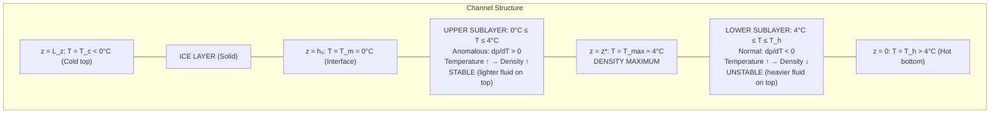

# Governing Equations for Plane Poiseuille Flow with Water Density Anomaly and Phase-Change Interface

## 1. Problem Configuration

Consider a horizontal channel of total height $L_z$ consisting of two layers:

| Region | Phase | Domain | Description |
|--------|-------|--------|-------------|
| Liquid (water) | Fluid | $0 \leq z \leq h_0$ | Driven by imposed pressure gradient |
| Solid (ice) | Rigid | $h_0 \leq z \leq L_z$ | Purely conducting |

**Coordinate system:** $x$ is horizontal (streamwise), $z$ is vertical (upward), $\hat{\mathbf{k}}$ is the unit vector in the $+z$ direction.

**Key temperatures:**
- $T_h > 4\,°\text{C}$: hot bottom plate temperature at $z = 0$
- $T_{max} \approx 4\,°\text{C}$: temperature of maximum water density
- $T_m = 0\,°\text{C}$: melting/freezing temperature at the ice–water interface $z = h_0$
- $T_c < 0\,°\text{C}$: cold top boundary temperature at $z = L_z$

---

## 2. Equation of State: The Density Anomaly of Water

### 2.1 Physical Motivation

Unlike most fluids, water does **not** expand monotonically with temperature. Water reaches its maximum density at $T_{max} \approx 3.98\,°\text{C}$. For temperatures both above and below $T_{max}$, the density decreases. The standard linear Boussinesq approximation $\rho = \rho_0[1 - \alpha(T - T_0)]$ fails to capture this behavior.

### 2.2 Quadratic Equation of State

We adopt a **quadratic equation of state** that captures the density maximum:

$$\boxed{\rho(T) = \rho_{max}\left[1 - \gamma\left(T - T_{max}\right)^2\right]}$$

where:
- $\rho_{max}$: maximum density of water, attained at $T = T_{max}$
- $\gamma > 0$: a positive empirical coefficient (units: $\text{K}^{-2}$), experimentally $\gamma \approx 8.0 \times 10^{-6}\,\text{K}^{-2}$
- $T_{max} \approx 3.98\,°\text{C}$: temperature of maximum density

> [!NOTE]
> This quadratic form ensures that $\rho(T) \leq \rho_{max}$ for all $T$, with equality only at $T = T_{max}$. The effective thermal expansion coefficient is:
> $$\alpha_{eff}(T) = -\frac{1}{\rho}\frac{\partial \rho}{\partial T} = \frac{2\gamma(T - T_{max})}{1 - \gamma(T - T_{max})^2} \approx 2\gamma(T - T_{max})$$
> which **changes sign** at $T = T_{max}$: positive for $T > T_{max}$ (normal expansion) and negative for $T < T_{max}$ (anomalous contraction upon heating).

---

## 3. Derivation of the Governing Equations — Liquid Phase ($0 \leq z \leq h_0$)

### 3.1 Starting Point: Full Compressible Equations

The exact governing equations for a Newtonian, viscous fluid are:

**Mass conservation:**
$$\frac{\partial \rho}{\partial t} + \nabla \cdot (\rho\,\mathbf{u}) = 0$$

**Momentum conservation (Cauchy):**
$$\rho\left(\frac{\partial \mathbf{u}}{\partial t} + \mathbf{u}\cdot\nabla\mathbf{u}\right) = -\nabla p + \nabla\cdot\boldsymbol{\tau} + \rho\,\mathbf{g}$$

where $\boldsymbol{\tau} = \mu\left[\nabla\mathbf{u} + (\nabla\mathbf{u})^T\right] - \frac{2}{3}\mu(\nabla\cdot\mathbf{u})\,\mathbf{I}$ is the viscous stress tensor.

**Energy conservation:**
$$\rho\,c_p\left(\frac{\partial T}{\partial t} + \mathbf{u}\cdot\nabla T\right) = \nabla\cdot(k_l\,\nabla T) + \Phi$$

where $\Phi$ is viscous dissipation.

### 3.2 Applying the Boussinesq Approximation

The Boussinesq approximation rests on three assumptions:

1. **Density variations are small**: $|\rho - \rho_{max}|/\rho_{max} = \gamma(T_l - T_{max})^2 \ll 1$
2. **Density variations matter only in the buoyancy term** (coupling with gravity)
3. **All other fluid properties** ($\mu$, $k_l$, $c_p$, $\kappa$) are treated as constants evaluated at the reference state

#### Step 1 — Continuity Equation

Since density variations are negligible except in the buoyancy term, the flow is treated as incompressible:

$$\nabla\cdot\mathbf{u} = 0 \quad \Longrightarrow \quad \boxed{\frac{\partial u}{\partial x} + \frac{\partial w}{\partial z} = 0}$$

where $\mathbf{u} = (u, w)$ in 2D, with $u$ the streamwise and $w$ the vertical velocity component.

#### Step 2 — Momentum Equation: Pressure Decomposition

We decompose the total pressure into a **hydrostatic reference** part and a **dynamic perturbation**:

$$p(\mathbf{x}, t) = p_s(z) + p_d(\mathbf{x}, t)$$

The hydrostatic reference is defined by the balance at the reference density $\rho_{max}$:

$$\nabla p_s = \rho_{max}\,\mathbf{g} = -\rho_{max}\,g\,\hat{\mathbf{k}}$$

$$\Longrightarrow \quad \frac{dp_s}{dz} = -\rho_{max}\,g$$

Substituting $p = p_s + p_d$ into the full momentum equation:

$$\rho\left(\frac{\partial \mathbf{u}}{\partial t} + \mathbf{u}\cdot\nabla\mathbf{u}\right) = -\nabla p_s - \nabla p_d + \mu\nabla^2\mathbf{u} + \rho\,\mathbf{g}$$

Using $\nabla p_s = \rho_{max}\,\mathbf{g}$:

$$\rho\left(\frac{\partial \mathbf{u}}{\partial t} + \mathbf{u}\cdot\nabla\mathbf{u}\right) = -\nabla p_d + \mu\nabla^2\mathbf{u} + (\rho - \rho_{max})\,\mathbf{g}$$

#### Step 3 — Substituting the Quadratic Equation of State

The density deviation from the reference is:

$$\rho - \rho_{max} = \rho_{max}\left[1 - \gamma(T_l - T_{max})^2\right] - \rho_{max} = -\rho_{max}\,\gamma\,(T_l - T_{max})^2$$

With $\mathbf{g} = -g\,\hat{\mathbf{k}}$, the buoyancy force becomes:

$$(\rho - \rho_{max})\,\mathbf{g} = \left[-\rho_{max}\,\gamma\,(T_l - T_{max})^2\right]\left(-g\,\hat{\mathbf{k}}\right) = +\rho_{max}\,g\,\gamma\,(T_l - T_{max})^2\,\hat{\mathbf{k}}$$

#### Step 4 — Applying the Boussinesq Approximation to the Inertial Term

On the left-hand side, replace $\rho \approx \rho_{max}$ (since density variations are small):

$$\rho_{max}\left(\frac{\partial \mathbf{u}}{\partial t} + \mathbf{u}\cdot\nabla\mathbf{u}\right) = -\nabla p_d + \mu\nabla^2\mathbf{u} + \rho_{max}\,g\,\gamma\,(T_l - T_{max})^2\,\hat{\mathbf{k}}$$

Dividing through by $\rho_{max}$ and defining $\nu = \mu/\rho_{max}$:

$$\frac{\partial \mathbf{u}}{\partial t} + \mathbf{u}\cdot\nabla\mathbf{u} = -\frac{1}{\rho_{max}}\nabla p_d + g\,\gamma\,(T_l - T_{max})^2\,\hat{\mathbf{k}} + \nu\,\nabla^2\mathbf{u}$$

#### Step 5 — Component Form

**$x$-momentum (horizontal):**

$$\boxed{\frac{\partial u}{\partial t} + u\frac{\partial u}{\partial x} + w\frac{\partial u}{\partial z} = -\frac{1}{\rho_{max}}\frac{\partial p_d}{\partial x} + \nu\left(\frac{\partial^2 u}{\partial x^2} + \frac{\partial^2 u}{\partial z^2}\right)}$$

**$z$-momentum (vertical) — contains the anomalous buoyancy:**

$$\boxed{\frac{\partial w}{\partial t} + u\frac{\partial w}{\partial x} + w\frac{\partial w}{\partial z} = -\frac{1}{\rho_{max}}\frac{\partial p_d}{\partial z} + g\,\gamma\,(T_l - T_{max})^2 + \nu\left(\frac{\partial^2 w}{\partial x^2} + \frac{\partial^2 w}{\partial z^2}\right)}$$

> [!NOTE]
> The buoyancy term $g\gamma(T_l - T_{max})^2$ is **always non-negative**. It vanishes only when $T_l = T_{max}$. This is fundamentally different from the standard linear Boussinesq term $g\alpha(T - T_0)$, which changes sign linearly. Here, the buoyancy is **symmetric** about $T_{max}$ and always acts upward for fluid parcels away from $T_{max}$.

### 3.3 Energy Equation — Liquid Phase

Under the Boussinesq approximation, neglecting viscous dissipation and with constant thermal diffusivity $\kappa_l = k_l / (\rho_{max}\,c_p)$:

$$\boxed{\frac{\partial T_l}{\partial t} + u\frac{\partial T_l}{\partial x} + w\frac{\partial T_l}{\partial z} = \kappa_l\left(\frac{\partial^2 T_l}{\partial x^2} + \frac{\partial^2 T_l}{\partial z^2}\right)}$$

---

## 4. Governing Equation — Solid Phase ($h_0 \leq z \leq L_z$)

### 4.1 Derivation

The ice is rigid and stationary ($\mathbf{u}_s = \mathbf{0}$). The energy equation reduces to pure thermal diffusion. Starting from the general energy equation with $\mathbf{u} = \mathbf{0}$:

$$\rho_s\,c_{p,s}\frac{\partial T_s}{\partial t} = \nabla\cdot(k_s\,\nabla T_s)$$

With constant thermal conductivity $k_s$ and defining $\kappa_s = k_s/(\rho_s\,c_{p,s})$:

$$\boxed{\frac{\partial T_s}{\partial t} = \kappa_s\left(\frac{\partial^2 T_s}{\partial x^2} + \frac{\partial^2 T_s}{\partial z^2}\right)}$$

---

## 5. Derivation of the Stefan Condition at $z = h(x, t)$

### 5.1 Energy Balance at the Phase Interface

The ice–water interface is located at $z = h(x, t)$, with the unperturbed position at $z = h_0$. At this interface, phase change (melting or freezing) occurs. The energy balance at the moving interface requires that the **net heat flux imbalance** across the interface must supply the **latent heat** needed for the phase transformation.

Consider a thin control volume straddling the interface. The heat fluxes are:

- **From the solid (ice) side**: $\mathbf{q}_s = -k_s\,\nabla T_s$
- **From the liquid (water) side**: $\mathbf{q}_l = -k_l\,\nabla T_l$

The interface moves with velocity $v_n = \frac{\partial h}{\partial t}\,(\hat{\mathbf{n}}\cdot\hat{\mathbf{k}})$ in the normal direction $\hat{\mathbf{n}}$.

### 5.2 General Stefan Condition

The energy balance at the interface gives:

$$\rho_s\,L_s\,v_n = \hat{\mathbf{n}}\cdot\left[\mathbf{q}_l - \mathbf{q}_s\right]_{z=h}$$

where $L_s$ is the specific latent heat of fusion (J/kg), and $\hat{\mathbf{n}}$ is the unit normal pointing from the liquid into the solid. The convention $[\mathbf{q}_l - \mathbf{q}_s]$ ensures that a net heat flux surplus from the liquid side drives melting ($v_n > 0$).

### 5.3 Simplification for a Nearly Flat Interface

For small interface perturbations, the outward normal from the liquid side is approximately $\hat{\mathbf{n}} \approx \hat{\mathbf{k}}$ and $v_n \approx \partial h / \partial t$. Substituting $\mathbf{q}_l = -k_l\,\nabla T_l$ and $\mathbf{q}_s = -k_s\,\nabla T_s$:

$$\rho_s\,L_s\,\frac{\partial h}{\partial t} = \hat{\mathbf{k}}\cdot\left[(-k_l\,\nabla T_l) - (-k_s\,\nabla T_s)\right]_{z=h} = \hat{\mathbf{k}}\cdot\left[k_s\,\nabla T_s - k_l\,\nabla T_l\right]_{z=h}$$

Evaluating the $z$-components of the gradients:

$$\boxed{\rho_s\,L_s\,\frac{\partial h}{\partial t} = \left[k_s\,\frac{\partial T_s}{\partial z} - k_l\,\frac{\partial T_l}{\partial z}\right]_{z=h(x,t)}}$$

> [!NOTE]
> **Sign convention interpretation:** The heat flux from the liquid toward the interface is $-k_l\,\partial T_l/\partial z > 0$ (positive, since $\partial T_l/\partial z < 0$). The heat flux conducted away from the interface through the ice is $-k_s\,\partial T_s/\partial z > 0$ (also positive, since $\partial T_s/\partial z < 0$). When the liquid supplies more heat than the ice removes, i.e., $(-k_l\,\partial T_l/\partial z) > (-k_s\,\partial T_s/\partial z)$, then $k_s\,\partial T_s/\partial z - k_l\,\partial T_l/\partial z > 0$, causing **melting** ($\partial h/\partial t > 0$, interface rises). The reverse causes **freezing**.

> [!TIP]
> For the more general case of a non-flat interface $z = h(x,t)$, the exact outward unit normal is:
> $$\hat{\mathbf{n}} = \frac{-\frac{\partial h}{\partial x}\,\hat{\mathbf{i}} + \hat{\mathbf{k}}}{\sqrt{1 + \left(\frac{\partial h}{\partial x}\right)^2}}$$
> and the Stefan condition becomes:
> $$\rho_s\,L_s\,\frac{\partial h / \partial t}{\sqrt{1 + (\partial h/\partial x)^2}} = \hat{\mathbf{n}}\cdot\left[k_s\,\nabla T_s - k_l\,\nabla T_l\right]_{z=h}$$

---

## 6. Complete Set of Governing Equations — Summary

### Liquid Phase ($0 \leq z \leq h_0$)

$$\frac{\partial u}{\partial x} + \frac{\partial w}{\partial z} = 0 \tag{1}$$

$$\frac{\partial u}{\partial t} + u\frac{\partial u}{\partial x} + w\frac{\partial u}{\partial z} = -\frac{1}{\rho_{max}}\frac{\partial p_d}{\partial x} + \nu\left(\frac{\partial^2 u}{\partial x^2} + \frac{\partial^2 u}{\partial z^2}\right) \tag{2}$$

$$\frac{\partial w}{\partial t} + u\frac{\partial w}{\partial x} + w\frac{\partial w}{\partial z} = -\frac{1}{\rho_{max}}\frac{\partial p_d}{\partial z} + g\,\gamma\,(T_l - T_{max})^2 + \nu\left(\frac{\partial^2 w}{\partial x^2} + \frac{\partial^2 w}{\partial z^2}\right) \tag{3}$$

$$\frac{\partial T_l}{\partial t} + u\frac{\partial T_l}{\partial x} + w\frac{\partial T_l}{\partial z} = \kappa_l\left(\frac{\partial^2 T_l}{\partial x^2} + \frac{\partial^2 T_l}{\partial z^2}\right) \tag{4}$$

### Solid Phase ($h_0 \leq z \leq L_z$)

$$\frac{\partial T_s}{\partial t} = \kappa_s\left(\frac{\partial^2 T_s}{\partial x^2} + \frac{\partial^2 T_s}{\partial z^2}\right) \tag{5}$$

### Stefan Condition at $z = h(x,t)$

$$\rho_s\,L_s\,\frac{\partial h}{\partial t} = \left[k_s\,\frac{\partial T_s}{\partial z} - k_l\,\frac{\partial T_l}{\partial z}\right]_{z=h(x,t)} \tag{6}$$

> [!IMPORTANT]
> In Eq. (2), the dynamic pressure $p_d$ contains the imposed Poiseuille driving gradient. Explicitly: $\frac{\partial p_d}{\partial x} = -G + \frac{\partial p'}{\partial x}$, where $G > 0$ is the constant imposed pressure gradient and $p'$ is the perturbation pressure.

---

## 7. Derivation of Boundary Conditions

### 7.1 Velocity Boundary Conditions

#### At the bottom plate, $z = 0$:

For Plane Poiseuille flow, the bottom plate is **stationary** (unlike Couette flow where it moves at $U_\infty$). The no-slip and no-penetration conditions give:

$$\boxed{u(x, 0, t) = 0, \qquad w(x, 0, t) = 0}$$

**Derivation:** The no-slip condition follows from the continuum hypothesis—fluid molecules in contact with a solid wall are at rest relative to the wall. Since the bottom plate is stationary in the Poiseuille configuration (as opposed to moving at $U_\infty$ in Couette flow), both velocity components vanish.

#### At the ice–water interface, $z = h_0$:

The ice is a rigid solid. The no-slip and no-penetration conditions at the interface give:

$$\boxed{u(x, h_0, t) = 0, \qquad w(x, h_0, t) = 0}$$

**Derivation:** The ice surface acts as a rigid, stationary wall for the liquid. In the frame of the unperturbed interface (for a stability analysis, perturbation velocities at the mean interface position are set to zero in the base state). The no-slip condition requires the tangential velocity to match the (zero) wall velocity; impermeability requires zero normal velocity.

> [!NOTE]
> **Contrast with Couette flow:** In the original Couette formulation, the bottom plate moved at $U_\infty$, giving $u(x,0,t) = U_\infty$. Now, with Poiseuille flow, **both** boundaries are stationary, and the flow is driven entirely by the imposed pressure gradient $G$.

### 7.2 Thermal Boundary Conditions

#### At the bottom plate, $z = 0$ (isothermal hot wall):

$$\boxed{T_l(x, 0, t) = T_h, \qquad T_h > 4\,°\text{C}}$$

**Derivation:** The bottom plate is maintained at a fixed temperature $T_h$ above the density maximum temperature. This is a Dirichlet (first-kind) boundary condition, physically representing a plate with very high thermal capacity or active heating that maintains a constant temperature regardless of heat exchange with the fluid.

#### At the ice–water interface, $z = h_0$ (phase equilibrium):

On the **liquid side**:
$$\boxed{T_l(x, h_0^-, t) = T_m = 0\,°\text{C}}$$

On the **solid side**:
$$\boxed{T_s(x, h_0^+, t) = T_m = 0\,°\text{C}}$$

**Derivation:** At the phase boundary, thermodynamic equilibrium requires that both phases coexist at the **melting temperature** $T_m$. This is a consequence of the Gibbs phase rule: at a fixed pressure (atmospheric), the solid–liquid equilibrium for a pure substance (water) occurs at a unique temperature. Any deviation from $T_m$ at the interface would drive it out of two-phase equilibrium, which is inconsistent with the existence of the interface at that location.

#### At the top boundary, $z = L_z$ (isothermal cold wall):

$$\boxed{T_s(x, L_z, t) = T_c, \qquad T_c < 0\,°\text{C}}$$

**Derivation:** The top of the ice layer is maintained at a subfreezing temperature $T_c$. This ensures that the ice layer remains frozen and provides the thermal driving force for heat conduction through the solid, which in turn affects the Stefan condition and the rate of phase change.

### 7.3 Summary of All Boundary Conditions

| Location | Velocity | Temperature |
|----------|----------|-------------|
| $z = 0$ (bottom plate) | $u = 0,\; w = 0$ | $T_l = T_h > 4\,°\text{C}$ |
| $z = h_0^-$ (liquid side of interface) | $u = 0,\; w = 0$ | $T_l = T_m = 0\,°\text{C}$ |
| $z = h_0^+$ (solid side of interface) | — (rigid solid) | $T_s = T_m = 0\,°\text{C}$ |
| $z = L_z$ (top boundary) | — (rigid solid) | $T_s = T_c < 0\,°\text{C}$ |
| $z = h(x,t)$ (Stefan) | — | $\rho_s L_s \frac{\partial h}{\partial t} = k_s\frac{\partial T_s}{\partial z} - k_l\frac{\partial T_l}{\partial z}$ |

---

## 8. Base State for Plane Poiseuille Flow

### 8.1 Base Velocity Profile

For the steady, fully developed base flow $\bar{U}(z)$ in the liquid layer, the $x$-momentum equation (2) reduces to:

$$0 = \frac{G}{\rho_{max}} + \nu\frac{d^2 \bar{U}}{dz^2}$$

With boundary conditions $\bar{U}(0) = 0$ and $\bar{U}(h_0) = 0$:

$$\frac{d^2 \bar{U}}{dz^2} = -\frac{G}{\mu}$$

Integrating twice:

$$\bar{U}(z) = -\frac{G}{2\mu}z^2 + C_1 z + C_2$$

Applying $\bar{U}(0) = 0$: $C_2 = 0$

Applying $\bar{U}(h_0) = 0$: $C_1 = \frac{G\,h_0}{2\mu}$

$$\boxed{\bar{U}(z) = \frac{G}{2\mu}\,z\,(h_0 - z)}$$

This is the classic parabolic Poiseuille profile, symmetric about $z = h_0/2$, with maximum velocity:

$$U_{max} = \bar{U}\!\left(\frac{h_0}{2}\right) = \frac{G\,h_0^2}{8\mu}$$

> [!NOTE]
> **Contrast with Couette:** The Couette base profile is $\bar{U}(z) = U_\infty z/h_0$ (linear). The Poiseuille profile is parabolic with zero velocity at both walls and maximum at the channel center. This fundamentally changes the shear distribution: Poiseuille flow has **symmetric shear** ($d\bar{U}/dz = 0$ at midplane), whereas Couette flow has **uniform shear**.

### 8.2 Base Temperature Profile

For the steady base state, the liquid temperature $\bar{T}_l(z)$ satisfies:

$$0 = \kappa_l\frac{d^2 \bar{T}_l}{dz^2}$$

with $\bar{T}_l(0) = T_h$ and $\bar{T}_l(h_0) = T_m$. The solution is linear:

$$\boxed{\bar{T}_l(z) = T_h + \frac{T_m - T_h}{h_0}\,z = T_h - \frac{T_h - T_m}{h_0}\,z}$$

For the solid:

$$0 = \kappa_s\frac{d^2 \bar{T}_s}{dz^2}$$

with $\bar{T}_s(h_0) = T_m$ and $\bar{T}_s(L_z) = T_c$:

$$\boxed{\bar{T}_s(z) = T_m + \frac{T_c - T_m}{L_z - h_0}\,(z - h_0)}$$

### 8.3 Location of the Density Maximum in the Base State

In the linear base temperature profile, the location $z^*$ where $\bar{T}_l(z^*) = T_{max}$ is:

$$T_{max} = T_h - \frac{T_h - T_m}{h_0}\,z^* \quad \Longrightarrow \quad \boxed{z^* = \frac{(T_h - T_{max})}{(T_h - T_m)}\,h_0}$$

Since $T_m < T_{max} < T_h$, we have $0 < z^* < h_0$, confirming that the density maximum lies **within** the liquid layer.

### 8.4 Non-Dimensionalization of the Full Governing System

Following the approach of the reference (§2.5), we non-dimensionalize the complete system of equations. The key modification is the replacement of the standard linear Rayleigh number $Ra = g\alpha\Delta T h_0^3/(\nu\kappa)$ with an **anomalous Rayleigh number** $Ra_\gamma$ that captures the quadratic equation of state.

#### 8.4.1 Choice of Scales

We choose the centreline velocity $U_0$ of the base Poiseuille profile as the velocity scale. From §8.1, $U_0 = U_{max} = G h_0^2/(8\mu)$. The complete set of scales is:

| Quantity | Scale | Symbol |
|----------|-------|--------|
| Length | $h_0$ (liquid layer depth) | $x = h_0\,x^*,\; z = h_0\,z^*$ |
| Velocity | $U_0 = G h_0^2/(8\mu)$ (centreline velocity) | $\mathbf{u} = U_0\,\mathbf{u}^*$ |
| Time | $t_0 = h_0^2/\kappa$ (diffusive time) | $t = t_0\,t^*$ |
| Pressure | $p_0 = \rho_{max}\,U_0\,\kappa/h_0$ | $p_d = p_0\,p^*$ |
| Temperature | $\Delta T = T_h - T_m$ | see $\theta$ below |

The non-dimensional temperatures are defined as:

$$\boxed{\theta_l = \frac{T_l - T_m}{\Delta T}, \qquad \theta_s = \frac{T_s - T_m}{\Delta T}}$$

so that $T_l = T_m + \Delta T\,\theta_l$ and $T_s = T_m + \Delta T\,\theta_s$.

> [!NOTE]
> The diffusive time scale $t_0 = h_0^2/\kappa$ (rather than the advective scale $h_0/U_0$) is chosen because the phase-change dynamics are governed by thermal diffusion. The pressure scale $p_0 = \rho_{max} U_0 \kappa / h_0$ is selected to balance the pressure gradient with the unsteady and viscous terms in the momentum equation.

#### 8.4.2 Non-Dimensional Governing Parameters

Five governing parameters arise, plus one new parameter $\theta_{max}$ specific to the density anomaly:

$$\boxed{Ra_\gamma = \frac{g\,\gamma\,(\Delta T)^2\,h_0^3}{\nu\,\kappa}}, \qquad Pe = \frac{U_0\,h_0}{\kappa}, \qquad Pr = \frac{\nu}{\kappa}$$

$$\boxed{S = \frac{L_s}{c_p\,(T_m - T_c)}}, \qquad \Lambda = \frac{T_m - T_c}{\Delta T}, \qquad \theta_{max} = \frac{T_{max} - T_m}{\Delta T}$$

| Parameter | Physical Meaning |
|-----------|-----------------|
| $Ra_\gamma$ | **Anomalous Rayleigh number** — ratio of buoyancy to viscous-diffusive forces, with $\gamma(\Delta T)^2$ replacing $\alpha\Delta T$ |
| $Pe$ | **Péclet number** — ratio of advective to diffusive heat transport |
| $Pr$ | **Prandtl number** — ratio of momentum to thermal diffusivity |
| $S$ | **Stefan number** — ratio of latent heat to sensible heat in the solid |
| $\Lambda$ | **Temperature ratio** — ratio of solid-side to liquid-side temperature differences |
| $\theta_{max}$ | **Non-dimensional density maximum temperature** — locates where $\rho = \rho_{max}$ within the $\theta$ field |

> [!IMPORTANT]
> **Key difference from the reference paper:** The paper uses the standard linear Rayleigh number $Ra = g\alpha\Delta T h_0^3/(\nu\kappa)$, giving a buoyancy term $(Ra\,Pr/Pe)\,\theta_l\,\hat{z}$. Our quadratic equation of state replaces this with $Ra_\gamma$ and a **squared** buoyancy term $(Ra_\gamma\,Pr/Pe)\,(\theta_l - \theta_{max})^2\,\hat{z}$, introducing the additional parameter $\theta_{max}$.

#### 8.4.3 Derivation of the Non-Dimensional Continuity Equation

Starting from the dimensional form $\frac{\partial u}{\partial x} + \frac{\partial w}{\partial z} = 0$ and substituting $u = U_0 u^*$, $x = h_0 x^*$, $w = U_0 w^*$, $z = h_0 z^*$:

$$\frac{U_0}{h_0}\frac{\partial u^*}{\partial x^*} + \frac{U_0}{h_0}\frac{\partial w^*}{\partial z^*} = 0$$

Dividing by $U_0/h_0$:

$$\boxed{\nabla\cdot\mathbf{u} = 0} \tag{ND-1}$$

#### 8.4.4 Derivation of the Non-Dimensional Momentum Equation

Starting from the dimensional vector form:

$$\frac{\partial \mathbf{u}}{\partial t} + \mathbf{u}\cdot\nabla\mathbf{u} = -\frac{1}{\rho_{max}}\nabla p_d + g\,\gamma\,(T_l - T_{max})^2\,\hat{z} + \nu\,\nabla^2\mathbf{u}$$

**Step 1 — Non-dimensionalize each term:**

- Unsteady term: $\frac{\partial \mathbf{u}}{\partial t} = \frac{U_0}{t_0}\frac{\partial \mathbf{u}^*}{\partial t^*} = \frac{U_0\,\kappa}{h_0^2}\frac{\partial \mathbf{u}^*}{\partial t^*}$

- Advective term: $\mathbf{u}\cdot\nabla\mathbf{u} = \frac{U_0^2}{h_0}(\mathbf{u}^*\cdot\nabla^*)\mathbf{u}^*$

- Pressure term: $-\frac{1}{\rho_{max}}\nabla p_d = -\frac{p_0}{\rho_{max}\,h_0}\nabla^* p^* = -\frac{U_0\,\kappa}{h_0^2}\nabla^* p^*$

- Viscous term: $\nu\,\nabla^2\mathbf{u} = \frac{\nu\,U_0}{h_0^2}\nabla^{*2}\mathbf{u}^*$

- Buoyancy term: Express $T_l - T_{max} = \Delta T(\theta_l - \theta_{max})$, so:
$$g\,\gamma\,(T_l - T_{max})^2 = g\,\gamma\,(\Delta T)^2\,(\theta_l - \theta_{max})^2$$

**Step 2 — Divide through by $U_0\kappa/h_0^2$:**

$$\frac{\partial \mathbf{u}^*}{\partial t^*} + \frac{U_0\,h_0}{\kappa}(\mathbf{u}^*\cdot\nabla^*)\mathbf{u}^* = -\nabla^* p^* + \frac{g\,\gamma\,(\Delta T)^2\,h_0^2}{U_0\,\kappa}(\theta_l - \theta_{max})^2\hat{z} + \frac{\nu}{\kappa}\nabla^{*2}\mathbf{u}^*$$

**Step 3 — Identify non-dimensional groups:**

- $\frac{U_0 h_0}{\kappa} = Pe$
- $\frac{\nu}{\kappa} = Pr$
- $\frac{g\gamma(\Delta T)^2 h_0^2}{U_0\kappa} = \frac{g\gamma(\Delta T)^2 h_0^3}{\nu\kappa}\cdot\frac{\nu}{U_0 h_0} = Ra_\gamma\cdot\frac{Pr}{Pe} = \frac{Ra_\gamma\,Pr}{Pe}$

**Step 4 — Final non-dimensional momentum equation** (dropping asterisks):

$$\boxed{\frac{\partial \mathbf{u}}{\partial t} + Pe\left(\mathbf{u}\cdot\nabla\mathbf{u}\right) = -\nabla p + \frac{Ra_\gamma\,Pr}{Pe}\left(\theta_l - \theta_{max}\right)^2\hat{z} + Pr\,\nabla^2\mathbf{u}} \tag{ND-2}$$

> [!NOTE]
> **Comparison with the reference paper (Eq. 2.11):**
> | | Paper (linear Boussinesq) | This work (density anomaly) |
> |---|---|---|
> | Buoyancy term | $\frac{Ra\,Pr}{Pe}\,\theta_l\,\hat{z}$ | $\frac{Ra_\gamma\,Pr}{Pe}\,(\theta_l - \theta_{max})^2\,\hat{z}$ |
> | Rayleigh number | $Ra = \frac{g\alpha\Delta T h_0^3}{\nu\kappa}$ | $Ra_\gamma = \frac{g\gamma(\Delta T)^2 h_0^3}{\nu\kappa}$ |
> | Buoyancy vanishes at | $\theta_l = 0$ ($T = T_m$) | $\theta_l = \theta_{max}$ ($T = T_{max}$) |
>
> The structure $Ra\,Pr/Pe$ is identical; only the Rayleigh number definition and the functional form of the buoyancy change.

In component form:

**$x$-momentum:**
$$\frac{\partial u}{\partial t} + Pe\left(u\frac{\partial u}{\partial x} + w\frac{\partial u}{\partial z}\right) = -\frac{\partial p}{\partial x} + Pr\left(\frac{\partial^2 u}{\partial x^2} + \frac{\partial^2 u}{\partial z^2}\right) \tag{ND-2a}$$

**$z$-momentum (contains anomalous buoyancy):**
$$\frac{\partial w}{\partial t} + Pe\left(u\frac{\partial w}{\partial x} + w\frac{\partial w}{\partial z}\right) = -\frac{\partial p}{\partial z} + \frac{Ra_\gamma\,Pr}{Pe}\left(\theta_l - \theta_{max}\right)^2 + Pr\left(\frac{\partial^2 w}{\partial x^2} + \frac{\partial^2 w}{\partial z^2}\right) \tag{ND-2b}$$

#### 8.4.5 Derivation of the Non-Dimensional Energy Equation — Liquid

Starting from the dimensional form:

$$\frac{\partial T_l}{\partial t} + u\frac{\partial T_l}{\partial x} + w\frac{\partial T_l}{\partial z} = \kappa\,\nabla^2 T_l$$

Substituting $T_l = T_m + \Delta T\,\theta_l$, $t = (h_0^2/\kappa)\,t^*$, $\mathbf{u} = U_0\,\mathbf{u}^*$, $\nabla = \nabla^*/h_0$:

- LHS unsteady: $\frac{\Delta T\,\kappa}{h_0^2}\frac{\partial \theta_l}{\partial t^*}$
- LHS advective: $\frac{U_0\,\Delta T}{h_0}(\mathbf{u}^*\cdot\nabla^*)\theta_l$
- RHS diffusion: $\frac{\kappa\,\Delta T}{h_0^2}\nabla^{*2}\theta_l$

Dividing through by $\kappa\,\Delta T/h_0^2$:

$$\frac{\partial \theta_l}{\partial t^*} + \frac{U_0 h_0}{\kappa}(\mathbf{u}^*\cdot\nabla^*)\theta_l = \nabla^{*2}\theta_l$$

$$\boxed{\frac{\partial \theta_l}{\partial t} + Pe\left(\mathbf{u}\cdot\nabla\theta_l\right) = \nabla^2\theta_l} \tag{ND-3}$$

#### 8.4.6 Derivation of the Non-Dimensional Energy Equation — Solid

Starting from the dimensional form (assuming $\kappa_s = \kappa$ for simplicity, following the reference):

$$\frac{\partial T_s}{\partial t} = \kappa\,\nabla^2 T_s$$

Substituting $T_s = T_m + \Delta T\,\theta_s$:

$$\frac{\Delta T\,\kappa}{h_0^2}\frac{\partial \theta_s}{\partial t^*} = \frac{\kappa\,\Delta T}{h_0^2}\nabla^{*2}\theta_s$$

$$\boxed{\frac{\partial \theta_s}{\partial t} = \nabla^2\theta_s} \tag{ND-4}$$

> [!NOTE]
> If $\kappa_s \neq \kappa_l$, the solid energy equation becomes $\frac{\partial \theta_s}{\partial t} = \frac{\kappa_s}{\kappa_l}\nabla^2\theta_s$, introducing an additional diffusivity ratio parameter. The reference paper absorbs this by assuming equal thermal properties.

#### 8.4.7 Derivation of the Non-Dimensional Stefan Condition

Starting from the dimensional form (§5.3, assuming $k_s = k_l = k$ following the reference):

$$\rho_s\,L_s\,\frac{\partial h}{\partial t} = k\left[\frac{\partial T_s}{\partial z} - \frac{\partial T_l}{\partial z}\right]_{z=h}$$

**Step 1 — Substitute non-dimensional variables** ($h = h_0\,h^*$, $t = (h_0^2/\kappa)\,t^*$, $T = T_m + \Delta T\,\theta$, $z = h_0\,z^*$):

$$\rho_s\,L_s\,\frac{h_0\,\kappa}{h_0^2}\,\frac{\partial h^*}{\partial t^*} = k\,\frac{\Delta T}{h_0}\left[\frac{\partial \theta_s}{\partial z^*} - \frac{\partial \theta_l}{\partial z^*}\right]$$

$$\frac{\rho_s\,L_s\,\kappa}{h_0}\,\frac{\partial h^*}{\partial t^*} = \frac{k\,\Delta T}{h_0}\left[\frac{\partial \theta_s}{\partial z^*} - \frac{\partial \theta_l}{\partial z^*}\right]$$

**Step 2 — Divide both sides by $k\,\Delta T/h_0$:**

$$\frac{\rho_s\,L_s\,\kappa}{k\,\Delta T}\,\frac{\partial h^*}{\partial t^*} = \left[\frac{\partial \theta_s}{\partial z^*} - \frac{\partial \theta_l}{\partial z^*}\right]$$

**Step 3 — Simplify the coefficient** using $\kappa = k/(\rho\,c_p)$:

$$\frac{\rho_s\,L_s\,\kappa}{k\,\Delta T} = \frac{\rho_s\,L_s}{\rho\,c_p\,\Delta T}$$

For equal densities ($\rho_s \approx \rho$), this becomes $\frac{L_s}{c_p\,\Delta T}$. Using $\Delta T = (T_m - T_c)/\Lambda$:

$$\frac{L_s}{c_p\,\Delta T} = \frac{L_s}{c_p\,(T_m - T_c)} \cdot \frac{(T_m - T_c)}{\Delta T} = S \cdot \Lambda = \Lambda\,S$$

**Step 4 — Final non-dimensional Stefan condition:**

$$\Lambda\,S\,\frac{\partial h}{\partial t} = \left[\frac{\partial \theta_s}{\partial z} - \frac{\partial \theta_l}{\partial z}\right]_{z=h}$$

$$\boxed{\frac{\partial h}{\partial t} = \frac{1}{\Lambda\,S}\left[\frac{\partial \theta_s}{\partial z} - \frac{\partial \theta_l}{\partial z}\right]_{z=h}} \tag{ND-5}$$

This matches Eq. (2.14) of the reference paper exactly, with $v_n = \partial h/\partial t$ and $\mathbf{n}\cdot(q_s - q_l) = \partial\theta_s/\partial z - \partial\theta_l/\partial z$ (in the paper's normal convention).

#### 8.4.8 Derivation of the Non-Dimensional Boundary Conditions

**Temperature at the bottom plate ($z = 0$):**

$$T_l(0,t) = T_h \;\Longrightarrow\; \theta_l(0,t) = \frac{T_h - T_m}{\Delta T} = \frac{\Delta T}{\Delta T}$$

$$\boxed{\theta_l(z = 0, t) = \theta_h = 1} \tag{ND-BC1}$$

**Temperature at the top boundary ($z = L_z/h_0$):**

$$T_s(L_z,t) = T_c \;\Longrightarrow\; \theta_s(L_z/h_0,t) = \frac{T_c - T_m}{\Delta T} = \frac{-(T_m - T_c)}{\Delta T}$$

$$\boxed{\theta_s(z = L_z, t) = \theta_c = -\Lambda} \tag{ND-BC2}$$

**Temperature at the phase interface ($z = h$):**

At $z = h$, both phases are at the melting temperature $T_m$:

$$T_l(h,t) = T_s(h,t) = T_m \;\Longrightarrow\; \theta_l(h,t) = \theta_s(h,t) = \frac{T_m - T_m}{\Delta T}$$

$$\boxed{\theta_s(z = h, t) = \theta_l(z = h, t) = \theta_m = 0} \tag{ND-BC3}$$

**Velocity at the bottom plate ($z = 0$) — Poiseuille no-slip:**

$$u(0,t) = 0, \quad w(0,t) = 0 \;\Longrightarrow\; u^*(0,t^*) = 0, \quad w^*(0,t^*) = 0$$

$$\boxed{u(z = 0, t) = w(z = 0, t) = 0} \tag{ND-BC4}$$

**Velocity at the phase interface ($z = h$) — no-slip and no-penetration:**

$$\boxed{\mathbf{u}\cdot\hat{\mathbf{n}} = 0 \quad \text{and} \quad \mathbf{u}\cdot\hat{\mathbf{t}} = 0 \quad \text{at } z = h(x,t)} \tag{ND-BC5}$$

#### 8.4.9 Summary: Complete Non-Dimensional System

**Governing Equations** (liquid domain $0 \leq z \leq h$):

| Equation | Non-Dimensional Form | Ref. Paper Eq. |
|----------|---------------------|----------------|
| Continuity | $\nabla\cdot\mathbf{u} = 0$ | (2.10) |
| Momentum | $\frac{\partial \mathbf{u}}{\partial t} + Pe(\mathbf{u}\cdot\nabla\mathbf{u}) = -\nabla p + \frac{Ra_\gamma Pr}{Pe}(\theta_l - \theta_{max})^2\hat{z} + Pr\,\nabla^2\mathbf{u}$ | cf. (2.11) |
| Liquid energy | $\frac{\partial \theta_l}{\partial t} + Pe(\mathbf{u}\cdot\nabla\theta_l) = \nabla^2\theta_l$ | (2.12) |

**Solid phase** ($h \leq z \leq L_z$):

$$\frac{\partial \theta_s}{\partial t} = \nabla^2\theta_s$$

**Stefan condition** at $z = h(x,t)$:

$$\frac{\partial h}{\partial t} = \frac{1}{\Lambda S}\left[\frac{\partial \theta_s}{\partial z} - \frac{\partial \theta_l}{\partial z}\right]_{z=h}$$

**Boundary Conditions:**

| Location | Velocity | Temperature | Eq. |
|----------|----------|-------------|-----|
| $z = 0$ | $u = 0,\; w = 0$ | $\theta_l = 1$ | (ND-BC1,4) |
| $z = h$ | $\mathbf{u}\cdot\hat{\mathbf{n}} = \mathbf{u}\cdot\hat{\mathbf{t}} = 0$ | $\theta_l = \theta_s = 0$ | (ND-BC3,5) |
| $z = L_z$ | — | $\theta_s = -\Lambda$ | (ND-BC2) |

#### 8.4.10 Non-Dimensional Base-State Profiles

Using the non-dimensional variables, the base-state solutions from §8.1–§8.3 become:

**Base velocity** (Poiseuille, scaled by centreline velocity $U_0$):

$$\bar{U}(z) = \frac{G}{2\mu}\,h_0 z^*\,(h_0 - h_0 z^*) \cdot \frac{1}{U_0} = \frac{G h_0^2}{2\mu}\,z^*(1 - z^*) \cdot \frac{8\mu}{G h_0^2} = 4\,z^*(1 - z^*)$$

$$\boxed{\bar{u}(z) = 4z(1-z)}$$

This parabolic profile satisfies $\bar{u}(0) = 0$, $\bar{u}(1) = 0$, $\bar{u}(1/2) = 1$.

**Base liquid temperature:**

$$\bar{T}_l = T_h - \frac{T_h - T_m}{h_0}z \;\Longrightarrow\; \bar{\theta}_l = \frac{T_h - \frac{T_h - T_m}{h_0}(h_0 z^*) - T_m}{\Delta T} = \frac{\Delta T - \Delta T\,z^*}{\Delta T}$$

$$\boxed{\bar{\theta}_l(z) = 1 - z}$$

which decreases linearly from $\bar{\theta}_l(0) = 1$ to $\bar{\theta}_l(1) = 0$.

**Base solid temperature:**

$$\bar{T}_s = T_m + \frac{T_c - T_m}{L_z - h_0}(z - h_0) \;\Longrightarrow\; \bar{\theta}_s = \frac{T_c - T_m}{\Delta T}\cdot\frac{z^* - 1}{L_z/h_0 - 1}$$

Let $d_0 = L_z/h_0 - 1$ be the **non-dimensional thickness of the ice layer**. Also recall that $\frac{T_c - T_m}{\Delta T} = -\Lambda$. Substituting these in:

$$\bar{\theta}_s(z) = -\Lambda\,\frac{z - 1}{d_0} = \frac{\Lambda}{d_0}(1 - z)$$

$$\boxed{\bar{\theta}_s(z) = \frac{\Lambda}{d_0}(1 - z)}$$

This form exactly matches the reference paper. It correctly satisfies the boundary conditions at the interface $\bar{\theta}_s(1) = 0$ and at the top wall $\bar{\theta}_s(1 + d_0) = -\Lambda$.

**Location of density maximum:**

$$\bar{\theta}_l(z^*) = \theta_{max} \;\Longrightarrow\; 1 - z^* = \theta_{max}$$

$$\boxed{z^* = 1 - \theta_{max}}$$

**Non-dimensional base-state density profile:**

Substituting $\bar{\theta}_l(z) = 1 - z$ into the buoyancy term:

$$(\bar{\theta}_l - \theta_{max})^2 = (1 - z - \theta_{max})^2$$

| Location | $\bar{\theta}_l$ | $(\bar{\theta}_l - \theta_{max})^2$ |
|----------|-------------------|--------------------------------------|
| $z = 0$ (bottom) | $1$ | $(1 - \theta_{max})^2$ |
| $z = z^* = 1-\theta_{max}$ | $\theta_{max}$ | $0$ (density maximum) |
| $z = 1$ (interface) | $0$ | $\theta_{max}^2$ |

**Verification of the base-state x-momentum balance:**

For the steady base flow $\bar{u}(z)$, the $x$-momentum (ND-2a) with $\bar{w} = 0$, $\partial/\partial t = 0$ and noting $\bar{u}$ depends only on $z$ (so $\bar{u}\,\partial\bar{u}/\partial x = 0$) reduces to:

$$0 = -\frac{\partial \bar{p}}{\partial x} + Pr\,\frac{d^2\bar{u}}{dz^2}$$

Since $\bar{u} = 4z(1-z)$, we have $d^2\bar{u}/dz^2 = -8$. Therefore:

$$\frac{\partial \bar{p}}{\partial x} = Pr\,\frac{d^2\bar{u}}{dz^2} = -8\,Pr \qquad \checkmark$$

This constant horizontal pressure gradient is precisely the non-dimensionalised imposed driving gradient $G$.

**Base-state pressure:**

The base-state pressure $\bar{p}(x, z)$ is determined by two conditions: the $x$-momentum balance (which fixes the horizontal gradient) and the $z$-momentum balance (which fixes the vertical gradient).

*From the $x$-momentum* (derived above):

$$\frac{\partial \bar{p}}{\partial x} = -8\,Pr$$

*From the $z$-momentum* (ND-2b) in the base state ($\bar{w} = 0$, $\partial/\partial t = 0$, $\partial/\partial x = 0$, and all terms involving $w$ vanish):

$$0 = -\frac{\partial \bar{p}}{\partial z} + \frac{Ra_\gamma\,Pr}{Pe}\left(\bar{\theta}_l - \theta_{max}\right)^2$$

$$\Longrightarrow \quad \frac{\partial \bar{p}}{\partial z} = \frac{Ra_\gamma\,Pr}{Pe}\left(1 - z - \theta_{max}\right)^2$$

Integrating from $0$ to $z$:

$$\bar{p}(x,z) - \bar{p}(x,0) = \frac{Ra_\gamma\,Pr}{Pe}\int_0^z \left(1 - z' - \theta_{max}\right)^2 dz'$$

Evaluating the integral via the substitution $\phi = 1 - \theta_{max} - z'$:

$$\int_0^z (1 - z' - \theta_{max})^2\,dz' = \left[-\frac{(1 - z' - \theta_{max})^3}{3}\right]_0^z = \frac{(1 - \theta_{max})^3 - (1 - \theta_{max} - z)^3}{3}$$

Combining the $x$- and $z$-dependences:

$$\boxed{\bar{p}(x,z) = -8\,Pr\cdot x + \frac{Ra_\gamma\,Pr}{3\,Pe}\left[(1 - \theta_{max})^3 - (1 - \theta_{max} - z)^3\right] + p_{\text{ref}}}$$

where $p_{\text{ref}}$ is an arbitrary reference pressure constant.

**Verification of the base-state pressure gradients:**

$$\frac{\partial \bar{p}}{\partial x} = -8\,Pr \qquad \checkmark \quad (\text{drives the Poiseuille flow})$$

$$\frac{\partial \bar{p}}{\partial z} = \frac{Ra_\gamma\,Pr}{3\,Pe}\cdot 3(1 - \theta_{max} - z)^2 = \frac{Ra_\gamma\,Pr}{Pe}(1 - z - \theta_{max})^2 \qquad \checkmark \quad (\text{balances buoyancy})$$

> [!NOTE]
> The base-state pressure has two physically distinct contributions:
> 1. A **linearly decreasing** component in $x$ ($-8\,Pr\cdot x$) that drives the Poiseuille flow.
> 2. A **cubic polynomial** in $z$ that balances the anomalous buoyancy. Since the integrand $(1-z-\theta_{max})^2 \geq 0$ everywhere, this $z$-component is **monotonically non-decreasing** from $\bar{p}(x,0)$. Its gradient is zero only at $z = z^* = 1-\theta_{max}$ (where the buoyancy vanishes), and the pressure accumulates most rapidly below $z^*$ (lower sublayer, large buoyancy) and above $z^*$ (upper sublayer, moderate buoyancy approaching the interface).

---

## 9. Physical Interpretation: Effect of the Density Anomaly on Convective Stability

### 9.1 Two-Sublayer Structure

The density anomaly creates a fundamentally different stability landscape compared to the standard Boussinesq case. The liquid layer is divided into two sublayers by the density maximum at $z = z^*$:

### 9.2 Stability Analysis of Each Sublayer

#### Lower sublayer ($0 \leq z \leq z^*$): Gravitationally UNSTABLE

| Property | Value |
|----------|-------|
| Temperature range | $T_{max} \leq T_l \leq T_h$ |
| Temperature gradient | $dT/dz < 0$ (temperature decreases upward) |
| Effective $\alpha_{eff}$ | $> 0$ (normal thermal expansion) |
| Density gradient | $d\rho/dz > 0$ (heavier fluid on top) |
| Stability | **Unstable** — Rayleigh-Bénard-like convection |

In this sublayer, the fluid behaves normally: hotter (lighter) fluid lies below colder (heavier) fluid. This is the classic Rayleigh-Bénard configuration and is **gravitationally unstable** when the Rayleigh number exceeds a critical value.

#### Upper sublayer ($z^* \leq z \leq h_0$): Gravitationally STABLE

| Property | Value |
|----------|-------|
| Temperature range | $T_m \leq T_l \leq T_{max}$ |
| Temperature gradient | $dT/dz < 0$ (temperature decreases upward) |
| Effective $\alpha_{eff}$ | $< 0$ (anomalous: $d\rho/dT > 0$, so heating *increases* density) |
| Density gradient | $d\rho/dz < 0$ (lighter fluid on top) |
| Stability | **Stable** — despite the anomalous equation of state, the lighter fluid sits above heavier fluid |

> [!IMPORTANT]
> Although the density anomaly causes water to become *lighter* as it cools below $4\,°\text{C}$ (anomalous behavior), the resulting density stratification in this sublayer is **gravitationally stable**: the densest fluid ($\rho_{max}$ at $z = z^*$, $T = T_{max}$) sits at the bottom of this sublayer, while progressively lighter fluid (cooling toward $T_m = 0\,°\text{C}$) sits above. A fluid parcel displaced upward finds itself heavier than its surroundings and is pushed back down — a restoring (stable) configuration. However, this stable stratification can be **penetrated** by vigorous convective plumes originating from the unstable lower sublayer, leading to the phenomenon of **penetrative convection**.

### 9.3 Overall Density Profile

The base-state density profile, using the quadratic equation of state with the linear temperature profile, is:

$$\bar{\rho}(z) = \rho_{max}\left[1 - \gamma\left(\bar{T}_l(z) - T_{max}\right)^2\right]$$

This gives a **parabolic density profile** with a maximum at $z = z^*$:

$$\bar{\rho}(z) = \rho_{max}\left[1 - \gamma\left(T_h - \frac{T_h - T_m}{h_0}z - T_{max}\right)^2\right]$$

The density increases from $z = 0$ to $z = z^*$ (normal behavior), reaches its maximum at $z = z^*$, and then **decreases** from $z = z^*$ to $z = h_0$ (anomalous behavior).

### 9.4 Implications for the Poiseuille Configuration

The combined effect of the Poiseuille shear profile and the two-sublayer buoyancy structure leads to several physically important consequences:

1. **Penetrative convection**: The lower sublayer ($0 < z < z^*$) is gravitationally unstable and drives convection. The upper sublayer ($z^* < z < h_0$) is stably stratified, but vigorous convective plumes from the lower sublayer can **penetrate** into the stable region, overshooting the level $z^*$ of maximum density. This penetrative convection is a hallmark of the water density anomaly and controls how effectively heat is transported toward the ice interface.

2. **Shear–buoyancy interaction**: The parabolic velocity profile provides shear that varies with $z$. Near the walls ($z = 0$ and $z = h_0$), the shear is strongest; at the midplane, it vanishes. The interaction between this shear distribution and the unstable lower / stable upper buoyancy structure produces richer instability patterns than in Couette flow.

3. **Phase-boundary feedback**: Convective plumes that penetrate the stable upper sublayer bring warm fluid toward the ice interface, enhancing heat transfer and potentially accelerating melting ($\partial h/\partial t > 0$). Conversely, the stable stratification near the ice acts as a buffer that partially shields the interface from the convective motions below.

4. **Non-monotonic critical Rayleigh number**: The critical condition for onset of convection depends on the relative thickness of the two sublayers, which is controlled by the ratio $(T_h - T_{max})/(T_h - T_m)$. As $T_h$ increases, the unstable lower sublayer thickens ($z^*$ increases), lowering the effective critical Rayleigh number and making convection easier to initiate. The depth of penetration into the stable upper sublayer also depends on this ratio.

---

## 10. Notation Table

| Symbol | Definition | Units |
|--------|-----------|-------|
| $u, w$ | Streamwise and vertical velocity components | m/s |
| $p_d$ | Dynamic pressure (includes driving gradient) | Pa |
| $p'$ | Perturbation pressure | Pa |
| $G$ | Imposed pressure gradient, $G = -dP/dx > 0$ | Pa/m |
| $T_l, T_s$ | Liquid and solid temperatures | °C |
| $T_h$ | Bottom plate temperature ($> 4\,°\text{C}$) | °C |
| $T_m$ | Melting temperature ($= 0\,°\text{C}$) | °C |
| $T_c$ | Top boundary temperature ($< 0\,°\text{C}$) | °C |
| $T_{max}$ | Temperature of maximum density ($\approx 4\,°\text{C}$) | °C |
| $\rho_{max}$ | Maximum water density at $T_{max}$ | kg/m³ |
| $\gamma$ | Density anomaly coefficient | K⁻² |
| $\nu$ | Kinematic viscosity, $\mu/\rho_{max}$ | m²/s |
| $\kappa_l, \kappa_s$ | Thermal diffusivities (liquid, solid) | m²/s |
| $k_l, k_s$ | Thermal conductivities (liquid, solid) | W/(m·K) |
| $L_s$ | Specific latent heat of fusion | J/kg |
| $h_0$ | Unperturbed interface position | m |
| $h(x,t)$ | Perturbed interface position | m |
| $L_z$ | Total channel height | m |
| $z^*$ | Height of density maximum in base state | m |
