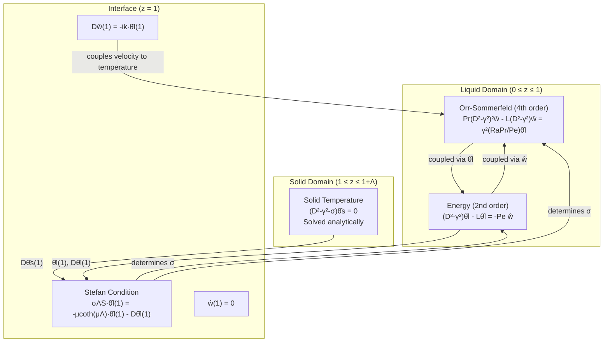

# Derivation of the Coupled Orr-Sommerfeld and Energy System for Phase Boundary Stability

**Based on:** S. Toppaladoddi & J. S. Wettlaufer, *"Shear, buoyancy and phase boundary stability"*, J. Fluid Mech. (2019)

**Key difference from the paper:** We retain the coupled $(\hat{w}, \hat{\theta}_l)$ system instead of reducing to a single 6th-order ODE in $\hat{\theta}_l$, and we keep full time dependence ($\sigma$ in all equations) without invoking the quasi-steady approximation $S \gg 1$.

---

## 1. Dimensional Governing Equations

### 1.1 Liquid Domain ($0 < z < h_0$)

The continuity, Boussinesq momentum, and heat-balance equations are:

$$\nabla \cdot \boldsymbol{u} = 0, \tag{1.1}$$

$$\frac{\partial \boldsymbol{u}}{\partial t} + \boldsymbol{u} \cdot \nabla\boldsymbol{u} = -\frac{1}{\rho_0}\nabla p + g\alpha(T_l - T_m)\boldsymbol{k} + \nu\nabla^2\boldsymbol{u}, \tag{1.2}$$

$$\frac{\partial T_l}{\partial t} + \boldsymbol{u} \cdot \nabla T_l = \kappa\nabla^2 T_l, \tag{1.3}$$

where $\boldsymbol{u}(\boldsymbol{x},t) = (u,v,w)$ is the velocity field, $\rho_0$ is the reference density, $p(\boldsymbol{x},t)$ is the pressure, $g$ is the gravitational acceleration, $\alpha$ is the thermal expansion coefficient, $T_l(\boldsymbol{x},t)$ is the liquid temperature, $T_m$ is the melting temperature, $\nu$ is the kinematic viscosity, and $\kappa$ is the thermal diffusivity.

### 1.2 Solid Domain ($h_0 < z < L_z$)

$$\frac{\partial T_s}{\partial t} = \kappa\nabla^2 T_s. \tag{1.4}$$

### 1.3 Solid–Liquid Interface ($z = h_0$)

The Stefan condition (energy balance at the phase boundary):

$$\rho_0 L_s \frac{\partial h}{\partial t} = \boldsymbol{n}\cdot[\boldsymbol{q}_s - \boldsymbol{q}_l]\big|_{z=h_0}, \tag{1.5}$$

where $L_s$ is the latent heat of fusion, $\boldsymbol{n}$ is the unit vector pointing into the liquid, $\boldsymbol{q}_s = -k_{th}\nabla T_s\big|_{z=h^+}$ and $\boldsymbol{q}_l = -k_{th}\nabla T_l\big|_{z=h^-}$ are the heat fluxes from the solid and liquid sides respectively.

> [!NOTE]
> The liquid and solid are assumed to have the **same density** $\rho_0$ and the **same thermal diffusivity** $\kappa$. This equal-density assumption means there is no volume change upon phase change, so the velocity boundary condition at the interface is simply $\boldsymbol{u} = 0$ (no-slip on the stationary solid).

---

## 2. Non-dimensionalization

### 2.1 Chosen Scales

| Quantity | Scale | Symbol |
|----------|-------|--------|
| Length | liquid layer depth | $h_0$ |
| Time | thermal diffusion time | $t_0 = h_0^2/\kappa$ |
| Velocity | imposed shear velocity | $U_\infty$ |
| Pressure | viscous-diffusive scale | $p_0 = \rho_0 U_\infty \kappa / h_0$ |
| Temperature | liquid superheat | $\Delta T = T_h - T_m$ |

The non-dimensional variables (denoted by the same symbols hereafter) are:

$$\boldsymbol{x}^* = \frac{\boldsymbol{x}}{h_0},\quad t^* = \frac{t\kappa}{h_0^2},\quad \boldsymbol{u}^* = \frac{\boldsymbol{u}}{U_\infty},\quad p^* = \frac{p}{\rho_0 U_\infty \kappa/h_0},\quad \theta_l = \frac{T_l - T_m}{\Delta T},\quad \theta_s = \frac{T_s - T_m}{\Delta T}.$$

### 2.2 Five Governing Parameters

$$Ra = \frac{g\alpha\Delta T\,h_0^3}{\nu\kappa}, \quad Pe = \frac{U_\infty h_0}{\kappa}, \quad Pr = \frac{\nu}{\kappa}, \quad S = \frac{L_s}{c_p(T_m - T_c)}, \quad \Lambda = \frac{T_m - T_c}{\Delta T}. \tag{2.1}$$

### 2.3 Derivation of Non-dimensional Momentum Equation

Starting from the dimensional x-momentum (and similarly for all components):

$$\frac{\partial \boldsymbol{u}_{dim}}{\partial t_{dim}} + \boldsymbol{u}_{dim}\cdot\nabla_{dim}\boldsymbol{u}_{dim} = -\frac{1}{\rho_0}\nabla_{dim}p_{dim} + g\alpha(T_l - T_m)\boldsymbol{k} + \nu\nabla_{dim}^2\boldsymbol{u}_{dim}$$

Substituting the scales:

- LHS term 1: $\dfrac{U_\infty\kappa}{h_0^2}\dfrac{\partial\boldsymbol{u}}{\partial t}$

- LHS term 2: $\dfrac{U_\infty^2}{h_0}(\boldsymbol{u}\cdot\nabla)\boldsymbol{u}$

- RHS pressure: $-\dfrac{U_\infty\kappa}{h_0^2}\nabla p$

- RHS buoyancy: $g\alpha\Delta T\,\theta_l\boldsymbol{k}$

- RHS viscous: $\dfrac{\nu U_\infty}{h_0^2}\nabla^2\boldsymbol{u}$

Dividing throughout by $U_\infty\kappa/h_0^2$:

$$\frac{\partial\boldsymbol{u}}{\partial t} + \frac{U_\infty h_0}{\kappa}(\boldsymbol{u}\cdot\nabla)\boldsymbol{u} = -\nabla p + \frac{g\alpha\Delta T\,h_0^2}{U_\infty\kappa}\theta_l\boldsymbol{k} + \frac{\nu}{\kappa}\nabla^2\boldsymbol{u}$$

Identifying $Pe = U_\infty h_0/\kappa$, $Pr = \nu/\kappa$, and:

$$\frac{g\alpha\Delta T\,h_0^2}{U_\infty\kappa} = \frac{g\alpha\Delta T\,h_0^3}{\nu\kappa}\cdot\frac{\nu}{U_\infty h_0} = Ra\cdot\frac{Pr}{Pe},$$

we obtain the non-dimensional momentum equation.

### 2.4 Derivation of Non-dimensional Energy Equation (Liquid)

$$\frac{\partial T_l}{\partial t_{dim}} + \boldsymbol{u}_{dim}\cdot\nabla_{dim}T_l = \kappa\nabla_{dim}^2 T_l$$

Substituting $T_l = T_m + \Delta T\,\theta_l$ and dividing by $\kappa\Delta T/h_0^2$:

$$\frac{\partial\theta_l}{\partial t} + \frac{U_\infty h_0}{\kappa}(\boldsymbol{u}\cdot\nabla\theta_l) = \nabla^2\theta_l$$

$$\frac{\partial\theta_l}{\partial t} + Pe(\boldsymbol{u}\cdot\nabla\theta_l) = \nabla^2\theta_l$$

### 2.5 Derivation of Non-dimensional Stefan Condition

Starting from $\rho_0 L_s\dfrac{\partial h_{dim}}{\partial t_{dim}} = \boldsymbol{n}\cdot[\boldsymbol{q}_s - \boldsymbol{q}_l]$:

- LHS: $\rho_0 L_s\dfrac{\kappa}{h_0}\dfrac{\partial h}{\partial t}$

- RHS: $k_{th}\dfrac{\Delta T}{h_0}[D\theta_s - D\theta_l]$ (with appropriate sign from $\boldsymbol{n}$)

Using $k_{th} = \rho_0 c_p\kappa$:

$$\frac{\partial h}{\partial t} = \frac{c_p\Delta T}{L_s}[D\theta_s - D\theta_l]$$

Now $\dfrac{c_p\Delta T}{L_s} = \dfrac{c_p(T_h-T_m)}{L_s} = \dfrac{1}{S}\cdot\dfrac{T_h-T_m}{T_m-T_c} = \dfrac{1}{S\Lambda}$, so:

$$\frac{\partial h}{\partial t} = \frac{1}{\Lambda S}[D\theta_s - D\theta_l]_{z=h}$$

### 2.6 Complete Non-dimensional System

$$\nabla\cdot\boldsymbol{u} = 0, \tag{2.2}$$

$$\frac{\partial\boldsymbol{u}}{\partial t} + Pe(\boldsymbol{u}\cdot\nabla)\boldsymbol{u} = -\nabla p + \frac{RaPr}{Pe}\theta_l\boldsymbol{k} + Pr\nabla^2\boldsymbol{u}, \tag{2.3}$$

$$\frac{\partial\theta_l}{\partial t} + Pe(\boldsymbol{u}\cdot\nabla\theta_l) = \nabla^2\theta_l, \tag{2.4}$$

$$\frac{\partial\theta_s}{\partial t} = \nabla^2\theta_s, \tag{2.5}$$

$$\frac{\partial h}{\partial t} = \frac{1}{\Lambda S}[D\theta_s - D\theta_l]_{z=h}. \tag{2.6}$$

### 2.7 Non-dimensional Boundary Conditions

**Thermal:**

$$\theta_s(z = 1+d_0, t) = -\Lambda, \quad \theta_s(z = 1, t) = 0, \tag{2.7a}$$

$$\theta_l(z = 0, t) = 1, \quad \theta_l(z = 1, t) = 0. \tag{2.7b}$$

**Velocity (equal-density assumption → $\boldsymbol{u} = 0$ at interface):**

$$u(z=0,t) = 1,\quad v(z=0,t) = w(z=0,t) = 0, \tag{2.8a}$$

$$u(z=1,t) = v(z=1,t) = w(z=1,t) = 0. \tag{2.8b}$$

---

## 3. Base-State Solutions — Step-by-Step Derivation

### 3.0 Assumptions for the Base State

The base state is the steady, unperturbed solution about which we will linearize. We assume:

1. **Steady**: $\frac{\partial}{\partial t}(\text{everything}) = 0$ — no time dependence.
2. **Horizontally homogeneous**: $\frac{\partial}{\partial x}(\text{everything}) = 0$ and $\frac{\partial}{\partial y}(\text{everything}) = 0$ — no variation in $x$ or $y$.
3. **Unidirectional flow**: $\boldsymbol{u}^{(0)} = (u^{(0)}(z), 0, 0)$ — flow only in the $x$-direction, depending only on $z$.

Under these assumptions, all fields depend only on $z$, and the PDEs reduce to ODEs.

---

### 3.1 Vertical Velocity: $w^{(0)} = 0$

**Starting equation — Continuity (2.2):**

$$\nabla \cdot \boldsymbol{u} = \frac{\partial u}{\partial x} + \frac{\partial v}{\partial y} + \frac{\partial w}{\partial z} = 0$$

**Apply the base-state assumptions:**

Since $u^{(0)}$ depends only on $z$: $\frac{\partial u^{(0)}}{\partial x} = 0$.

Since $v^{(0)} = 0$: $\frac{\partial v^{(0)}}{\partial y} = 0$.

Continuity reduces to:

$$\frac{dw^{(0)}}{dz} = 0 \tag{3.1}$$

**Solve the ODE:**

Equation (3.1) says $w^{(0)} = \text{constant}$.

**Apply boundary condition:**

From (2.8a): $w(z=0, t) = 0$, so $w^{(0)}(0) = 0$.

Since $w^{(0)}$ is constant and equals zero at $z = 0$:

$$\boxed{w^{(0)}(z) = 0 \quad \text{for all } z} \tag{3.2}$$

**Also**: $v^{(0)} = 0$ everywhere (assumed unidirectional flow, confirmed by the y-momentum equation which gives $\frac{dp^{(0)}}{\partial y} = 0$, consistent with no forcing in $y$).

---

### 3.2 Horizontal Velocity: $u^{(0)}(z) = 1 - z$

**Starting equation — x-Momentum (2.3), x-component:**

$$\frac{\partial u}{\partial t} + Pe\left(u\frac{\partial u}{\partial x} + v\frac{\partial u}{\partial y} + w\frac{\partial u}{\partial z}\right) = -\frac{\partial p}{\partial x} + Pr\left(\frac{\partial^2 u}{\partial x^2} + \frac{\partial^2 u}{\partial y^2} + \frac{\partial^2 u}{\partial z^2}\right)$$

**Apply the base-state assumptions one by one:**

- $\frac{\partial u^{(0)}}{\partial t} = 0$ (steady)
- $\frac{\partial u^{(0)}}{\partial x} = 0$ (horizontally homogeneous) → the advection term $u^{(0)}\frac{\partial u^{(0)}}{\partial x} = 0$
- $v^{(0)} = 0$ → the term $v^{(0)}\frac{\partial u^{(0)}}{\partial y} = 0$
- $w^{(0)} = 0$ → the term $w^{(0)}\frac{\partial u^{(0)}}{\partial z} = 0$
- $\frac{\partial^2 u^{(0)}}{\partial x^2} = \frac{\partial^2 u^{(0)}}{\partial y^2} = 0$ (horizontally homogeneous)
- $\frac{\partial p^{(0)}}{\partial x} = 0$ (pressure is horizontally homogeneous — there is no imposed pressure gradient driving the flow; it is driven by the moving wall)

**All terms vanish except the viscous term:**

$$Pr\frac{d^2 u^{(0)}}{dz^2} = 0$$

Since $Pr \neq 0$:

$$\frac{d^2 u^{(0)}}{dz^2} = 0 \tag{3.3}$$

**Solve the ODE:**

This is a second-order ODE. Integrate once:

$$\frac{du^{(0)}}{dz} = a \quad \text{(constant)}$$

Integrate again:

$$u^{(0)}(z) = az + b \tag{3.4}$$

The general solution is a **linear function** of $z$ — this is the classic Couette flow profile.

**Apply boundary conditions:**

From (2.8a): $u(z=0, t) = 1$ → $u^{(0)}(0) = b = 1$.

From (2.8b): $u(z=1, t) = 0$ → $u^{(0)}(1) = a + 1 = 0$ → $a = -1$.

**Result:**

$$\boxed{u^{(0)}(z) = 1 - z} \tag{3.5}$$

**Physical meaning:** This is a **plane Couette flow** — the fluid is dragged by the bottom wall (moving at velocity $U_\infty$, or 1 in non-dimensional form) while the top boundary (the solid-liquid interface) is stationary. The velocity varies linearly between 1 at the bottom and 0 at the top.

**Key gradient:**

$$Du^{(0)} = \frac{d}{dz}(1-z) = -1 \tag{3.6}$$

This constant shear rate will appear in the linearized equations and will generate $\hat{h}$-coupling at the interface.

---

### 3.3 Liquid Temperature: $\theta_l^{(0)}(z) = 1 - z$

**Starting equation — Energy, liquid (2.4):**

$$\frac{\partial \theta_l}{\partial t} + Pe\left(u\frac{\partial \theta_l}{\partial x} + v\frac{\partial \theta_l}{\partial y} + w\frac{\partial \theta_l}{\partial z}\right) = \frac{\partial^2 \theta_l}{\partial x^2} + \frac{\partial^2 \theta_l}{\partial y^2} + \frac{\partial^2 \theta_l}{\partial z^2}$$

**Apply the base-state assumptions:**

- $\frac{\partial \theta_l^{(0)}}{\partial t} = 0$ (steady)
- $\frac{\partial \theta_l^{(0)}}{\partial x} = 0$ (horizontally homogeneous) → $u^{(0)}\frac{\partial \theta_l^{(0)}}{\partial x} = 0$
- $v^{(0)} = 0$ → $v^{(0)}\frac{\partial \theta_l^{(0)}}{\partial y} = 0$
- $w^{(0)} = 0$ → **the crucial advection term $w^{(0)}\frac{\partial \theta_l^{(0)}}{\partial z} = 0$**
- $\frac{\partial^2 \theta_l^{(0)}}{\partial x^2} = \frac{\partial^2 \theta_l^{(0)}}{\partial y^2} = 0$ (horizontally homogeneous)

> [!NOTE]
> Even though $u^{(0)} \neq 0$, it does not advect $\theta_l^{(0)}$ because $\theta_l^{(0)}$ has no $x$-dependence. The advection term $u^{(0)}\frac{\partial \theta_l^{(0)}}{\partial x} = u^{(0)} \cdot 0 = 0$. Only $w^{(0)}$ could advect the temperature (since $\theta_l^{(0)}$ depends on $z$), but $w^{(0)} = 0$.

**The energy equation reduces to pure conduction:**

$$\frac{d^2 \theta_l^{(0)}}{dz^2} = 0 \tag{3.7}$$

**Solve the ODE:**

Integrate twice:

$$\theta_l^{(0)}(z) = cz + d \tag{3.8}$$

Again, a linear profile — pure conduction gives a linear temperature distribution.

**Apply boundary conditions:**

From (2.7b): $\theta_l(z=0, t) = 1$ → $\theta_l^{(0)}(0) = d = 1$.

From (2.7b): $\theta_l(z=1, t) = 0$ → $\theta_l^{(0)}(1) = c + 1 = 0$ → $c = -1$.

**Result:**

$$\boxed{\theta_l^{(0)}(z) = 1 - z} \tag{3.9}$$

**Physical meaning:** Heat conducts linearly from the hot bottom wall ($\theta_l = 1$ at $z=0$) to the melting interface ($\theta_l = 0$ at $z=1$). There is no convection in the base state because $w^{(0)} = 0$ — the flow is purely horizontal (Couette) and does not transport heat vertically.

**Key gradient:**

$$D\theta_l^{(0)} = \frac{d}{dz}(1-z) = -1 \tag{3.10}$$

This base-state temperature gradient will:
1. Generate $\hat{h}$-coupling at the interface (§9.3.6)
2. Produce the $-Pe\hat{w}$ source term in the linearized energy equation (§5.5)

---

### 3.4 Solid Temperature: $\theta_s^{(0)}(z) = \frac{\Lambda}{d_0}(1 - z)$

**Starting equation — Energy, solid (2.5):**

$$\frac{\partial \theta_s}{\partial t} = \nabla^2 \theta_s$$

**Apply the base-state assumptions** (steady, horizontally homogeneous):

$$\frac{d^2 \theta_s^{(0)}}{dz^2} = 0 \tag{3.11}$$

**Solve the ODE:**

$$\theta_s^{(0)}(z) = ez + f \tag{3.12}$$

**Apply boundary conditions:**

The solid occupies $z \in [1, 1+d_0]$ where $d_0$ is the (unknown) base-state solid thickness.

From (2.7a): $\theta_s(z=1, t) = 0$ (melting temperature at interface):

$$\theta_s^{(0)}(1) = e + f = 0 \quad \implies \quad f = -e \tag{3.13}$$

From (2.7a): $\theta_s(z=1+d_0, t) = -\Lambda$ (cold temperature at top wall):

$$\theta_s^{(0)}(1+d_0) = e(1+d_0) + f = e(1+d_0) - e = e\cdot d_0 = -\Lambda$$

$$\implies \quad e = -\frac{\Lambda}{d_0} \tag{3.14}$$

Therefore $f = -e = \frac{\Lambda}{d_0}$.

**Result:**

$$\theta_s^{(0)}(z) = -\frac{\Lambda}{d_0}z + \frac{\Lambda}{d_0} = \frac{\Lambda}{d_0}(1 - z) \tag{3.15}$$

$$\boxed{\theta_s^{(0)}(z) = \frac{\Lambda}{d_0}(1 - z), \quad z \in [1, 1+d_0]} \tag{3.16}$$

**Verification:**
- $\theta_s^{(0)}(1) = \frac{\Lambda}{d_0}(1-1) = 0$ ✓ (melting temperature)
- $\theta_s^{(0)}(1+d_0) = \frac{\Lambda}{d_0}(1-1-d_0) = -\Lambda$ ✓ (cold wall temperature)

**Key gradient:**

$$D\theta_s^{(0)} = -\frac{\Lambda}{d_0} \tag{3.17}$$

Note: $d_0$ is still unknown at this point. It will be determined by the Stefan condition.

---

### 3.5 Base-State Solid Thickness: $d_0 = \Lambda$ (from the Stefan Condition)

**Starting equation — Stefan condition (2.6) in the base state:**

$$\frac{\partial h^{(0)}}{\partial t} = \frac{1}{\Lambda S}[D\theta_s^{(0)} - D\theta_l^{(0)}]_{z=1}$$

**Apply the steady-state assumption:**

The base-state interface is stationary:

$$\frac{\partial h^{(0)}}{\partial t} = 0 \tag{3.18}$$

**This gives the condition:**

$$0 = \frac{1}{\Lambda S}[D\theta_s^{(0)}(1) - D\theta_l^{(0)}(1)]$$

Since $\frac{1}{\Lambda S} \neq 0$:

$$D\theta_s^{(0)}(1) - D\theta_l^{(0)}(1) = 0 \tag{3.19}$$

**Physical meaning:** In the base state, the heat flux leaving through the solid must **exactly balance** the heat flux arriving from the liquid. If they were not equal, the interface would move (freeze or melt), and we would not have a steady state.

**Substitute the gradients:**

From (3.17): $D\theta_s^{(0)}(1) = -\Lambda/d_0$

From (3.10): $D\theta_l^{(0)}(1) = -1$

$$-\frac{\Lambda}{d_0} - (-1) = 0$$

$$1 - \frac{\Lambda}{d_0} = 0$$

$$\frac{\Lambda}{d_0} = 1$$

$$\boxed{d_0 = \Lambda} \tag{3.20}$$

**Physical meaning:** The base-state solid thickness equals $\Lambda = (T_m - T_c)/(T_h - T_m)$, the ratio of the temperature drop across the solid to the temperature drop across the liquid. This makes intuitive sense:

- If $\Lambda$ is large (cold wall much colder than melting point, relative to the superheat), the solid must be thicker to maintain the same heat flux (since the gradient $\sim \Delta T / \text{thickness}$).
- If $\Lambda$ is small, the solid is thin.
- At $\Lambda = 1$, the temperature drops are equal across both phases, and $d_0 = 1$ (the solid is as thick as the liquid).

**With $d_0 = \Lambda$, the solid temperature simplifies to:**

$$\theta_s^{(0)}(z) = \frac{\Lambda}{\Lambda}(1-z) = 1 - z \tag{3.21}$$

And the solid gradient becomes:

$$D\theta_s^{(0)}(1) = -\frac{\Lambda}{\Lambda} = -1 \tag{3.22}$$

Both phases have the **same gradient** ($-1$) at the interface — the heat fluxes are balanced, as required.

---

### 3.6 Pressure: $p^{(0)}(z)$ (hydrostatic balance)

For completeness, the base-state pressure is determined by the z-momentum equation.

**Starting equation — z-Momentum (2.3), z-component:**

$$\frac{\partial w}{\partial t} + Pe(\boldsymbol{u}\cdot\nabla)w = -\frac{\partial p}{\partial z} + \frac{RaPr}{Pe}\theta_l + Pr\nabla^2 w$$

**Apply base-state assumptions** ($w^{(0)} = 0$, steady, horizontally homogeneous):

All terms vanish except pressure and buoyancy:

$$0 = -\frac{dp^{(0)}}{dz} + \frac{RaPr}{Pe}\theta_l^{(0)}$$

$$\frac{dp^{(0)}}{dz} = \frac{RaPr}{Pe}(1-z) \tag{3.23}$$

**Integrate:**

$$p^{(0)}(z) = \frac{RaPr}{Pe}\left(z - \frac{z^2}{2}\right) + \text{const} \tag{3.24}$$

This is the hydrostatic pressure distribution. It does not enter the stability analysis (it cancels when we linearize), so we do not need its explicit form.

---

### 3.7 Summary of Base State

| Field | Base-state solution | Domain |
|-------|-------------------|--------|
| $u^{(0)}(z)$ | $1-z$ (Couette flow) | $z \in [0,1]$ |
| $v^{(0)}(z)$ | $0$ | $z \in [0,1]$ |
| $w^{(0)}(z)$ | $0$ | $z \in [0,1]$ |
| $\theta_l^{(0)}(z)$ | $1-z$ (linear conduction) | $z \in [0,1]$ |
| $\theta_s^{(0)}(z)$ | $1-z$ (linear conduction, using $d_0=\Lambda$) | $z \in [1, 1+\Lambda]$ |
| $d_0$ | $\Lambda$ (from Stefan balance) | — |

**Key gradients at interface ($z = 1$):**

$$Du^{(0)} = -1, \quad D\theta_l^{(0)} = -1, \quad D\theta_s^{(0)} = -1 \tag{3.25}$$

All three gradients are $-1$, which leads to the uniform coupling structure in the interface boundary conditions (§9).

---

## 4. Linear Stability Analysis

### 4.1 Perturbation Ansatz

We introduce infinitesimal perturbations about the base state:

$$\begin{bmatrix} u \\ v \\ w \\ p \\ \theta_l \\ \theta_s \end{bmatrix} = \begin{bmatrix} u^{(0)}(z) \\ 0 \\ 0 \\ p^{(0)}(z) \\ \theta_l^{(0)}(z) \\ \theta_s^{(0)}(z) \end{bmatrix} + \epsilon \begin{bmatrix} \hat{u}(z) \\ \hat{v}(z) \\ \hat{w}(z) \\ \hat{p}(z) \\ \hat{\theta}_l(z) \\ \hat{\theta}_s(z) \end{bmatrix} \exp(ikx + imy + \sigma t), \quad \epsilon \ll 1. \tag{4.1}$$

The interface position is perturbed as:

$$h(x,y,t) = 1 + \epsilon\,\hat{h}\,\exp(ikx + imy + \sigma t), \tag{4.2}$$

where:
- $k, m$ are horizontal wavenumbers,
- $\gamma^2 = k^2 + m^2$ is the total horizontal wavenumber squared,
- $\sigma$ is the **temporal growth rate** in the full non-dimensional time $t$ (scaled by $h_0^2/\kappa$),
- $\hat{h}$ is the interface perturbation amplitude.

> [!IMPORTANT]
> Unlike the paper (which introduces $t_1 = t/S$ and drops $\sigma/S$ terms from the bulk for $S \gg 1$), we **retain $\sigma$ in all equations** — momentum, liquid energy, solid energy, and the Stefan condition. This makes the formulation valid for arbitrary Stefan number $S$.

### 4.2 Notation

$$D \equiv \frac{d}{dz}, \quad \gamma^2 \equiv k^2 + m^2, \quad \mathcal{L}(z) \equiv \sigma + ikPe\,u^{(0)}(z). \tag{4.3}$$

Note that $\mathcal{L}$ depends on $z$ through the base-state velocity $u^{(0)}(z) = 1-z$.

---

## 5. Linearized Perturbation Equations

Substituting (4.1) into the non-dimensional system (2.2)–(2.5) and retaining terms at $O(\epsilon)$:

### 5.1 Continuity

$$\nabla\cdot\boldsymbol{u}' = 0 \implies ik\hat{u} + im\hat{v} + D\hat{w} = 0. \tag{5.1}$$

### 5.2 x-Momentum

The full equation is:

$$\frac{\partial u}{\partial t} + Pe\left(u\frac{\partial u}{\partial x} + v\frac{\partial u}{\partial y} + w\frac{\partial u}{\partial z}\right) = -\frac{\partial p}{\partial x} + Pr\nabla^2 u.$$

The non-trivial linearized terms come from:
- Time derivative: $\sigma\hat{u}$
- Advection by base flow: $Pe\cdot u^{(0)}\cdot ik\hat{u}$
- **Perturbation vertical velocity acting on base shear**: $Pe\cdot\hat{w}\cdot Du^{(0)} = Pe\cdot\hat{w}\cdot(-1) = -Pe\hat{w}$

$$\boxed{\mathcal{L}\hat{u} - Pe\hat{w} = -ik\hat{p} + Pr(D^2 - \gamma^2)\hat{u}} \tag{5.2}$$

> [!NOTE]
> The term $-Pe\hat{w}$ is the **lift-up effect**: vertical perturbation velocity $\hat{w}$ transports the base-state shear $Du^{(0)} = -1$, generating a horizontal velocity perturbation. This term has no analogue in the y-momentum because $Dv^{(0)} = 0$.

### 5.3 y-Momentum

$$\boxed{\mathcal{L}\hat{v} = -im\hat{p} + Pr(D^2 - \gamma^2)\hat{v}} \tag{5.3}$$

No $\hat{w}$ coupling here because $v^{(0)} = 0$ everywhere (no base-state gradient in $y$).

### 5.4 z-Momentum

$$\frac{\partial w}{\partial t} + Pe\left(u\frac{\partial w}{\partial x} + w\frac{\partial w}{\partial z}\right) = -\frac{\partial p}{\partial z} + \frac{RaPr}{Pe}\theta_l + Pr\nabla^2 w$$

At $O(\epsilon)$ (noting $w^{(0)} = 0$, $Dw^{(0)} = 0$):

$$\boxed{\mathcal{L}\hat{w} = -D\hat{p} + Pr(D^2 - \gamma^2)\hat{w} + \frac{RaPr}{Pe}\hat{\theta}_l} \tag{5.4}$$

The buoyancy term $\frac{RaPr}{Pe}\hat{\theta}_l$ is the driving force for convective instability.

### 5.5 Energy — Liquid

$$\frac{\partial\theta_l}{\partial t} + Pe\left(u\frac{\partial\theta_l}{\partial x} + w\frac{\partial\theta_l}{\partial z}\right) = \nabla^2\theta_l$$

The linearized terms include:
- Advection of base temperature by perturbation velocity: $Pe\cdot\hat{w}\cdot D\theta_l^{(0)} = Pe\cdot\hat{w}\cdot(-1) = -Pe\hat{w}$

$$\boxed{\mathcal{L}\hat{\theta}_l - Pe\hat{w} = (D^2 - \gamma^2)\hat{\theta}_l} \tag{5.5}$$

The term $-Pe\hat{w}$ is the crucial coupling: vertical perturbation velocity advects the base-state temperature gradient, generating temperature perturbations.

### 5.6 Energy — Solid

No advection in the solid ($\boldsymbol{u} = 0$):

$$\sigma\hat{\theta}_s = (D^2 - \gamma^2)\hat{\theta}_s$$

$$\boxed{(D^2 - \gamma^2 - \sigma)\hat{\theta}_s = 0} \tag{5.6}$$

> [!IMPORTANT]
> The $\sigma$ term is retained here. In the paper's quasi-steady treatment, this would reduce to $(D^2 - \gamma^2)\hat{\theta}_s = 0$. Keeping $\sigma$ modifies the solid temperature profile and its gradient at the interface.

---

## 6. Derivation of the Orr-Sommerfeld Equation

We now eliminate $\hat{u}$, $\hat{v}$, and $\hat{p}$ from the momentum equations to obtain a single equation for $\hat{w}$.

### Step 1: Combine horizontal momentum equations

Multiply (5.2) by $ik$ and (5.3) by $im$, then add:

$$\mathcal{L}(ik\hat{u} + im\hat{v}) - ikPe\hat{w} = -(ik)^2\hat{p} - (im)^2\hat{p} + Pr(D^2-\gamma^2)(ik\hat{u} + im\hat{v})$$

$$\mathcal{L}(ik\hat{u} + im\hat{v}) - ikPe\hat{w} = (k^2+m^2)\hat{p} + Pr(D^2-\gamma^2)(ik\hat{u} + im\hat{v})$$

### Step 2: Apply continuity

From (5.1): $ik\hat{u} + im\hat{v} = -D\hat{w}$. Substituting:

$$-\mathcal{L}D\hat{w} - ikPe\hat{w} = \gamma^2\hat{p} - Pr(D^2-\gamma^2)D\hat{w}$$

Solving for $\hat{p}$:

$$\gamma^2\hat{p} = -\mathcal{L}D\hat{w} - ikPe\hat{w} + Pr(D^2-\gamma^2)D\hat{w} \tag{6.1}$$

### Step 3: Extract $D\hat{p}$ from the z-momentum

From (5.4):

$$D\hat{p} = -\mathcal{L}\hat{w} + Pr(D^2-\gamma^2)\hat{w} + \frac{RaPr}{Pe}\hat{\theta}_l \tag{6.2}$$

### Step 4: Differentiate equation (6.1)

Taking $D$ of (6.1):

$$\gamma^2 D\hat{p} = -D[\mathcal{L}D\hat{w}] - D[ikPe\hat{w}] + PrD[(D^2-\gamma^2)D\hat{w}]$$

We compute each term:

**Term 1:** $D[\mathcal{L}D\hat{w}]$

Since $\mathcal{L} = \sigma + ikPe\,u^{(0)}(z)$ and $Du^{(0)} = -1$:

$$D\mathcal{L} = ikPe\cdot Du^{(0)} = ikPe\cdot(-1) = -ikPe$$

By the product rule:

$$D[\mathcal{L}D\hat{w}] = (D\mathcal{L})D\hat{w} + \mathcal{L}D^2\hat{w} = -ikPe\,D\hat{w} + \mathcal{L}D^2\hat{w}$$

**Term 2:** $D[ikPe\hat{w}] = ikPe\,D\hat{w}$

**Term 3:** $D[(D^2-\gamma^2)D\hat{w}] = D[D^3\hat{w} - \gamma^2D\hat{w}] = D^4\hat{w} - \gamma^2D^2\hat{w}$

Assembling:

$$\gamma^2 D\hat{p} = -(-ikPe\,D\hat{w} + \mathcal{L}D^2\hat{w}) - ikPe\,D\hat{w} + Pr(D^4 - \gamma^2D^2)\hat{w}$$

$$= ikPe\,D\hat{w} - \mathcal{L}D^2\hat{w} - ikPe\,D\hat{w} + Pr(D^4 - \gamma^2D^2)\hat{w}$$

> [!TIP]
> The two $ikPe\,D\hat{w}$ terms **cancel exactly**. This cancellation is a consequence of $D^2u^{(0)} = 0$ (linear base-state profile). For a non-linear base flow, an additional term involving $D^2u^{(0)}$ would survive.

$$\gamma^2 D\hat{p} = -\mathcal{L}D^2\hat{w} + Pr(D^4 - \gamma^2D^2)\hat{w} \tag{6.3}$$

### Step 5: Eliminate $D\hat{p}$

Multiply (6.2) by $\gamma^2$:

$$\gamma^2 D\hat{p} = -\gamma^2\mathcal{L}\hat{w} + Pr\gamma^2(D^2-\gamma^2)\hat{w} + \gamma^2\frac{RaPr}{Pe}\hat{\theta}_l \tag{6.4}$$

Equate (6.3) and (6.4):

$$-\mathcal{L}D^2\hat{w} + Pr(D^4-\gamma^2D^2)\hat{w} = -\gamma^2\mathcal{L}\hat{w} + Pr\gamma^2(D^2-\gamma^2)\hat{w} + \gamma^2\frac{RaPr}{Pe}\hat{\theta}_l$$

### Step 6: Collect terms

**LHS viscous terms:**

$$Pr(D^4-\gamma^2D^2)\hat{w} - Pr\gamma^2(D^2-\gamma^2)\hat{w} = Pr(D^4 - 2\gamma^2D^2 + \gamma^4)\hat{w} = Pr(D^2-\gamma^2)^2\hat{w}$$

**RHS inertial terms:**

$$\mathcal{L}D^2\hat{w} - \gamma^2\mathcal{L}\hat{w} = \mathcal{L}(D^2-\gamma^2)\hat{w}$$

### Result: The Orr-Sommerfeld Equation with Buoyancy

$$\boxed{Pr(D^2-\gamma^2)^2\hat{w} - \underbrace{(\sigma + ikPe\,u^{(0)})}_{\mathcal{L}}(D^2-\gamma^2)\hat{w} = \gamma^2\frac{RaPr}{Pe}\hat{\theta}_l} \tag{6.5}$$

This is a **4th-order ODE** for $\hat{w}(z)$, coupled to $\hat{\theta}_l$ through the buoyancy term on the RHS.

**Physical interpretation of each term:**

| Term | Physical meaning |
|------|-----------------|
| $Pr(D^2-\gamma^2)^2\hat{w}$ | Viscous diffusion of vorticity |
| $\sigma(D^2-\gamma^2)\hat{w}$ | Temporal growth of perturbation vorticity |
| $ikPe\,u^{(0)}(D^2-\gamma^2)\hat{w}$ | Advection of perturbation vorticity by base shear flow |
| $\gamma^2\frac{RaPr}{Pe}\hat{\theta}_l$ | Buoyancy forcing from temperature perturbations |

**Special cases:**
- $Ra = 0$: reduces to the classical Orr-Sommerfeld equation (no thermal coupling)
- $Pe = 0$ (no base flow): reduces to the Rayleigh-Bénard vorticity equation
- $\sigma = 0$: marginal stability (neutral curve)

---

## 7. Energy Equation (Liquid) — Rearranged

From (5.5), rearranging:

$$\boxed{(D^2-\gamma^2)\hat{\theta}_l - (\sigma + ikPe\,u^{(0)})\hat{\theta}_l = -Pe\,\hat{w}} \tag{7.1}$$

This is a **2nd-order ODE** for $\hat{\theta}_l(z)$, coupled to $\hat{w}$ through the term $-Pe\hat{w}$ on the RHS.

**Physical interpretation:**
- LHS: thermal diffusion minus advection by base flow and temporal growth
- RHS: production of temperature perturbations by the vertical velocity acting on the base-state temperature gradient ($D\theta_l^{(0)} = -1$)

---

## 8. Solid Temperature — Analytical Solution

### 8.1 Governing Equation

$$(D^2 - \gamma^2 - \sigma)\hat{\theta}_s = 0, \quad z \in [1, 1+\Lambda] \tag{8.1}$$

Define:

$$\mu = \sqrt{\gamma^2 + \sigma} \tag{8.2}$$

> [!NOTE]
> When $\sigma$ is retained, $\mu$ depends on the growth rate, modifying the solid temperature profile compared to the quasi-steady case where $\mu = \gamma$.

### 8.2 General Solution

$$\hat{\theta}_s(z) = C_1\,e^{\mu(z-1)} + C_2\,e^{-\mu(z-1)} \tag{8.3}$$

### 8.3 Boundary Conditions

**At interface** $z = 1$ (derived in §9 below):

$$\hat{\theta}_s(1) = \hat{h} \tag{8.4a}$$

**At top wall** $z = 1 + \Lambda$ (fixed cold temperature, wall not perturbed):

$$\hat{\theta}_s(1+\Lambda) = 0 \tag{8.4b}$$

### 8.4 Solving for Constants

From (8.4a): $C_1 + C_2 = \hat{h}$

From (8.4b): $C_1\,e^{\mu\Lambda} + C_2\,e^{-\mu\Lambda} = 0 \implies C_1 = -C_2\,e^{-2\mu\Lambda}$

Substituting:

$$C_2(1 - e^{-2\mu\Lambda}) = \hat{h} \implies C_2 = \frac{\hat{h}}{1-e^{-2\mu\Lambda}}$$

$$C_1 = \frac{-\hat{h}\,e^{-2\mu\Lambda}}{1-e^{-2\mu\Lambda}}$$

### 8.5 Interface Gradient

$$D\hat{\theta}_s(z) = \mu\bigl(C_1\,e^{\mu(z-1)} - C_2\,e^{-\mu(z-1)}\bigr)$$

At $z = 1$:

$$D\hat{\theta}_s(1) = \mu(C_1 - C_2) = \mu\cdot\frac{-\hat{h}(e^{-2\mu\Lambda}+1)}{1-e^{-2\mu\Lambda}}$$

Recognizing $\dfrac{1+e^{-2\mu\Lambda}}{1-e^{-2\mu\Lambda}} = \dfrac{e^{\mu\Lambda}+e^{-\mu\Lambda}}{e^{\mu\Lambda}-e^{-\mu\Lambda}} = \coth(\mu\Lambda)$:

$$\boxed{D\hat{\theta}_s(1) = -\mu\coth(\mu\Lambda)\,\hat{h}} \tag{8.5}$$

> [!IMPORTANT]
> This result reduces to $-\gamma\coth(\gamma\Lambda)\hat{h}$ when $\sigma = 0$ (or in the quasi-steady limit), recovering the paper's result. The $\sigma$-dependence through $\mu = \sqrt{\gamma^2 + \sigma}$ introduces a coupling between the solid thermal response and the growth rate.

---

## 9. Boundary Conditions — Complete Step-by-Step Derivation

### 9.0 Why Do We Need Special Treatment at the Interface?

Before deriving any boundary condition, it is essential to understand the **domain perturbation problem**.

Our governing ODEs (the Orr-Sommerfeld equation and the energy equation) are defined on the **liquid domain** $0 \leq z \leq 1$. The bottom wall at $z = 0$ is fixed. But the **top boundary of the liquid** — the solid-liquid interface — is not at $z = 1$ anymore. It has been perturbed to:

$$z = h(x,y,t) = 1 + \epsilon\hat{h}\,\exp(ikx + imy + \sigma t). \tag{9.0}$$

The physical boundary conditions (no-slip, no-penetration, fixed melting temperature) are imposed at the **actual** interface location $z = h$, not at $z = 1$. But we want to solve our ODEs on the **unperturbed** domain $0 \leq z \leq 1$.

**The solution**: We Taylor-expand every boundary condition imposed at $z = h$ about the unperturbed location $z = 1$, retaining terms up to $O(\epsilon)$. This transfers the conditions from the perturbed boundary to the fixed boundary, at the cost of introducing coupling to the interface perturbation amplitude $\hat{h}$.

---

### 9.1 The Taylor Expansion Procedure — Derived from First Principles

Consider any field $f(x,y,z,t)$ that has been decomposed as:

$$f(x,y,z,t) = f^{(0)}(z) + \epsilon\hat{f}(z)\,e^{i(kx+my)+\sigma t} + O(\epsilon^2). \tag{9.1}$$

Suppose the physical condition is $f = f_0$ (a constant) at $z = h = 1 + \epsilon\hat{h}\,e^{i(kx+my)+\sigma t}$.

**Step 1 — Write out what the condition means:**

$$f(x,y,z = h,t) = f_0. \tag{9.2}$$

**Step 2 — Taylor-expand $f$ about $z = 1$:**

Since $h = 1 + \epsilon\hat{h}\,e^{...}$ and $\epsilon$ is small:

$$f(x,y,h,t) = f(x,y,1,t) + (h - 1)\frac{\partial f}{\partial z}\bigg|_{z=1} + O(\epsilon^2)$$

$$= f(x,y,1,t) + \epsilon\hat{h}\,e^{...}\cdot\frac{\partial f}{\partial z}\bigg|_{z=1} + O(\epsilon^2). \tag{9.3}$$

**Step 3 — Substitute the perturbation decomposition (9.1) into (9.3):**

$$f(x,y,1,t) = f^{(0)}(1) + \epsilon\hat{f}(1)\,e^{...}$$

For the derivative term, at leading order:

$$\frac{\partial f}{\partial z}\bigg|_{z=1} = Df^{(0)}(1) + O(\epsilon)$$

(We only need the $O(1)$ part of the derivative because it is already multiplied by $\epsilon\hat{h}$.)

So:

$$f(x,y,h,t) = f^{(0)}(1) + \epsilon\hat{f}(1)\,e^{...} + \epsilon\hat{h}\,e^{...}\cdot Df^{(0)}(1) + O(\epsilon^2)$$

$$= f^{(0)}(1) + \epsilon\bigl[\hat{f}(1) + \hat{h}\,Df^{(0)}(1)\bigr]\,e^{...} + O(\epsilon^2). \tag{9.4}$$

**Step 4 — Apply the boundary condition $f = f_0$:**

$$f^{(0)}(1) + \epsilon\bigl[\hat{f}(1) + \hat{h}\,Df^{(0)}(1)\bigr]\,e^{...} = f_0. \tag{9.5}$$

**Step 5 — Separate by orders of $\epsilon$:**

At $O(1)$ (the base state):

$$f^{(0)}(1) = f_0. \tag{9.6}$$

This is just the base-state boundary condition — it is already satisfied by our base-state solution.

At $O(\epsilon)$ (the perturbation):

$$\hat{f}(1) + \hat{h}\,Df^{(0)}(1) = 0$$

$$\boxed{\hat{f}(1) = -\hat{h}\,Df^{(0)}(1)} \tag{9.7}$$

> [!IMPORTANT]
> **This is the key result.** The perturbation boundary condition at the interface has two contributions:
> 1. $\hat{f}(1)$ — the perturbation of the field itself at the unperturbed location
> 2. $\hat{h}\,Df^{(0)}(1)$ — the effect of the interface displacement on the base-state field
>
> If the base-state gradient $Df^{(0)}(1) = 0$, the second contribution vanishes and we simply get $\hat{f}(1) = 0$. If $Df^{(0)}(1) \neq 0$, the interface displacement "picks up" a perturbation from the base-state gradient, leading to $\hat{f}(1) = -\hat{h}\,Df^{(0)}(1)$.

---

### 9.2 Boundary Conditions at $z = 0$ — The Bottom Rigid Wall

The bottom wall is **fixed** (not perturbed), so no Taylor expansion is needed. Conditions are applied directly at $z = 0$.

---

#### 9.2.1 Velocity at $z = 0$

**Physical conditions (dimensional):**

From the problem setup, the bottom wall at $z = 0$ moves with velocity $U_\infty$ in the $x$-direction (it drives the Couette flow), and has no velocity in $y$ or $z$:

$$u_{dim}(z=0) = U_\infty, \quad v_{dim}(z=0) = 0, \quad w_{dim}(z=0) = 0.$$

**Non-dimensional form** (dividing by $U_\infty$):

$$u(z=0,t) = 1, \quad v(z=0,t) = 0, \quad w(z=0,t) = 0. \tag{9.8}$$

**Does the base state satisfy these?**

$$u^{(0)}(0) = 1-0 = 1 \quad \checkmark$$
$$v^{(0)}(0) = 0 \quad \checkmark$$
$$w^{(0)}(0) = 0 \quad \checkmark$$

Yes, the base state satisfies all velocity BCs at $z = 0$.

**Perturbation conditions:**

Since the base state already accounts for the full boundary value, the perturbation must contribute zero:

$$\hat{u}(0) = 0, \quad \hat{v}(0) = 0, \quad \hat{w}(0) = 0. \tag{9.9}$$

---

#### 9.2.2 Deriving $D\hat{w}(0) = 0$ from no-slip + continuity

We need a condition on $D\hat{w}$ at $z = 0$ for the Orr-Sommerfeld equation (which is 4th order in $\hat{w}$). We derive it from the no-slip conditions and the continuity equation.

**Starting point:** The linearized continuity equation (5.1) holds everywhere in the domain, including at $z = 0$:

$$ik\hat{u}(z) + im\hat{v}(z) + D\hat{w}(z) = 0 \quad \text{for all } z \in [0,1]. \tag{9.10}$$

**Evaluate at $z = 0$:**

$$ik\hat{u}(0) + im\hat{v}(0) + D\hat{w}(0) = 0.$$

**Substitute the no-slip values** from (9.9): $\hat{u}(0) = 0$, $\hat{v}(0) = 0$:

$$ik \cdot 0 + im \cdot 0 + D\hat{w}(0) = 0$$

$$\boxed{D\hat{w}(0) = 0.} \tag{9.11}$$

**Physical meaning:** At the rigid wall, all velocity components vanish. Since $\hat{u}$ and $\hat{v}$ are zero at $z = 0$ for all $x$ and $y$, the continuity equation forces $D\hat{w}(0) = 0$. In other words, the incompressibility constraint, combined with the no-slip condition on horizontal velocities, requires that the vertical velocity gradient also vanishes at the wall.

---

#### 9.2.3 Temperature at $z = 0$

**Physical condition (dimensional):** The bottom wall is maintained at the hot temperature $T_h$:

$$T_l(z=0, t) = T_h.$$

**Non-dimensional form:** Using $\theta_l = (T_l - T_m)/\Delta T$ and $\Delta T = T_h - T_m$:

$$\theta_l(z=0, t) = \frac{T_h - T_m}{T_h - T_m} = 1. \tag{9.12}$$

**Does the base state satisfy this?**

$$\theta_l^{(0)}(0) = 1 - 0 = 1 \quad \checkmark$$

**Perturbation condition:**

$$\hat{\theta}_l(0) = 0. \tag{9.13}$$

**Physical meaning:** The bottom wall temperature is held fixed. Any temperature perturbation must vanish at this wall — it acts as a "thermal ground."

---

#### 9.2.4 Summary of BCs at $z = 0$

We have **three conditions** for the $(\hat{w}, \hat{\theta}_l)$ system:

$$\hat{w}(0) = 0 \quad \text{(no penetration)}, \tag{9.14a}$$

$$D\hat{w}(0) = 0 \quad \text{(no-slip via continuity)}, \tag{9.14b}$$

$$\hat{\theta}_l(0) = 0 \quad \text{(fixed temperature)}. \tag{9.14c}$$

These are **three homogeneous Dirichlet/Neumann conditions** — straightforward, no $\hat{h}$ dependence, no coupling.

---

### 9.3 Boundary Conditions at $z = 1$ — The Perturbed Solid-Liquid Interface

This is where the derivation requires care. Every condition is applied at the **perturbed** interface $z = h = 1 + \epsilon\hat{h}\,e^{...}$ and must be Taylor-expanded to $z = 1$.

We use the general result (9.7) derived in §9.1:

$$\hat{f}(1) = -\hat{h}\,Df^{(0)}(1).$$

---

#### 9.3.1 Why $\boldsymbol{u} = 0$ at the interface?

Before applying velocity BCs, let us justify the condition $\boldsymbol{u} = 0$ at the solid-liquid interface.

**Physical reasoning:** The solid phase is at rest in the laboratory frame. The liquid is in contact with the solid at the interface. The **no-slip condition** requires that the fluid velocity matches the solid velocity at the contact surface. Since the solid is stationary:

$$\boldsymbol{u}(z=h) = 0. \tag{9.15}$$

**What about the moving interface?** One might object: if the interface moves (due to melting/freezing), shouldn't the velocity at the interface be non-zero?

The answer is **no**, because of the **equal-density assumption** ($\rho_{solid} = \rho_{liquid} = \rho_0$). When densities are equal, there is no volume change upon phase change. The interface moves, but no material is displaced — the phase transition happens "in place." Therefore, there is no induced fluid velocity at the interface, and the no-slip condition on the stationary solid gives $\boldsymbol{u} = 0$.

(If densities were unequal, there would be a Stefan velocity $\boldsymbol{u} \cdot \boldsymbol{n} \neq 0$ at the interface to accommodate the volume change. That case is more complicated and not considered here.)

---

#### 9.3.2 No-penetration: $w = 0$ at $z = h$

**The physical condition:**

$$w(x,y,z=h,t) = 0. \tag{9.16}$$

**Identify the field and base-state values:**

$$f = w, \quad f^{(0)}(z) = w^{(0)}(z) = 0 \text{ (everywhere)}, \quad f_0 = 0.$$

**Check the base state:** $w^{(0)}(1) = 0 = f_0$ ✓

**Compute the base-state gradient at $z = 1$:**

Since $w^{(0)}(z) = 0$ for all $z$, its derivative is also zero everywhere:

$$Dw^{(0)}(z) = \frac{d}{dz}(0) = 0 \quad \text{for all } z.$$

In particular: $Dw^{(0)}(1) = 0$.

**Apply the general result (9.7):**

$$\hat{w}(1) = -\hat{h} \cdot Dw^{(0)}(1) = -\hat{h} \cdot 0 = 0.$$

$$\boxed{\hat{w}(1) = 0} \tag{9.17}$$

**Key point:** There is **no $\hat{h}$ dependence** in this condition. This is because the base-state vertical velocity is identically zero — it has no gradient for the interface perturbation to "pick up." Moving the interface up or down by $\epsilon\hat{h}$ makes no difference because $w^{(0)} = 0$ everywhere.

---

#### 9.3.3 No-slip in $x$: $u = 0$ at $z = h$

**The physical condition:**

$$u(x,y,z=h,t) = 0. \tag{9.18}$$

**Identify the field and base-state values:**

$$f = u, \quad f^{(0)}(z) = u^{(0)}(z) = 1-z, \quad f_0 = 0.$$

**Check the base state:** $u^{(0)}(1) = 1-1 = 0 = f_0$ ✓

**Compute the base-state gradient at $z = 1$:**

$$Du^{(0)}(z) = \frac{d}{dz}(1-z) = -1 \quad \text{for all } z.$$

So: $Du^{(0)}(1) = -1$.

**This is non-zero!** This means the interface perturbation will couple into this BC.

**Apply the Taylor expansion step by step:**

Write $u$ at the perturbed interface:

$$u(x,y,h,t) = 0.$$

Taylor-expand about $z = 1$:

$$u(x,y,1,t) + (h-1)\frac{\partial u}{\partial z}\bigg|_{z=1} + O(\epsilon^2) = 0$$

$$\bigl[u^{(0)}(1) + \epsilon\hat{u}(1)e^{...}\bigr] + \epsilon\hat{h}e^{...}\cdot\bigl[Du^{(0)}(1) + O(\epsilon)\bigr] + O(\epsilon^2) = 0$$

At $O(1)$: $u^{(0)}(1) = 0$ ✓ (already satisfied)

At $O(\epsilon)$:

$$\hat{u}(1) + \hat{h}\,Du^{(0)}(1) = 0$$

$$\hat{u}(1) + \hat{h}\cdot(-1) = 0$$

$$\boxed{\hat{u}(1) = \hat{h}} \tag{9.19}$$

**Physical interpretation:** The base-state velocity profile is $u^{(0)} = 1-z$, which decreases linearly from 1 at the bottom to 0 at the interface. When the interface moves up by $\epsilon\hat{h}$, the fluid at the new interface location "sees" a base-state velocity of $u^{(0)}(1+\epsilon\hat{h}) \approx 0 + \epsilon\hat{h}\cdot(-1) = -\epsilon\hat{h}$. To maintain $u = 0$ at the new interface, the perturbation must compensate: $\hat{u}(1) = +\hat{h}$.

In other words, the perturbation velocity $\hat{u}$ must "undo" the base-state velocity that would otherwise exist at the perturbed interface location.

---

#### 9.3.4 No-slip in $y$: $v = 0$ at $z = h$

**The physical condition:**

$$v(x,y,z=h,t) = 0. \tag{9.20}$$

**Identify the field and base-state values:**

$$f = v, \quad f^{(0)}(z) = v^{(0)}(z) = 0 \text{ (everywhere)}, \quad f_0 = 0.$$

**Check the base state:** $v^{(0)}(1) = 0 = f_0$ ✓

**Compute the base-state gradient at $z = 1$:**

$$Dv^{(0)}(z) = \frac{d}{dz}(0) = 0 \quad \text{for all } z.$$

$Dv^{(0)}(1) = 0$.

**Apply the general result (9.7):**

$$\hat{v}(1) = -\hat{h} \cdot 0 = 0.$$

$$\boxed{\hat{v}(1) = 0} \tag{9.21}$$

**Key point:** Same reasoning as for $\hat{w}$: the base-state $v^{(0)}$ is identically zero, so moving the interface has no effect.

---

#### 9.3.5 Deriving $D\hat{w}(1) = -ik\hat{h}$ from no-slip + continuity

We now need a second condition on $\hat{w}$ at the interface (since the Orr-Sommerfeld equation is 4th order, requiring two BCs at each boundary for $\hat{w}$).

**Starting point:** The linearized continuity equation (5.1) holds everywhere in the liquid domain:

$$ik\hat{u}(z) + im\hat{v}(z) + D\hat{w}(z) = 0 \quad \text{for all } z. \tag{9.22}$$

**Evaluate at $z = 1$:**

$$ik\hat{u}(1) + im\hat{v}(1) + D\hat{w}(1) = 0. \tag{9.23}$$

**Substitute the values we just derived:**

From (9.19): $\hat{u}(1) = \hat{h}$

From (9.21): $\hat{v}(1) = 0$

$$ik \cdot \hat{h} + im \cdot 0 + D\hat{w}(1) = 0$$

$$ik\hat{h} + D\hat{w}(1) = 0$$

$$\boxed{D\hat{w}(1) = -ik\hat{h}} \tag{9.24}$$

**Physical interpretation:** At the perturbed interface, the no-slip condition forces $\hat{u}(1) = \hat{h} \neq 0$. Since the flow must remain incompressible (divergence-free), a non-zero $\hat{u}(1)$ with wavenumber $k$ in the $x$-direction creates a horizontal divergence $ik\hat{u}(1) = ik\hat{h}$. The continuity equation requires this to be balanced by a vertical velocity gradient $D\hat{w}(1) = -ik\hat{h}$.

**Note on the case $k = 0$:** If perturbations are purely in the $y$-direction ($k = 0$), then $D\hat{w}(1) = 0$, because $\hat{u}(1) = \hat{h}$ has no $x$-wavevector component to create horizontal divergence.

---

#### 9.3.6 Liquid temperature at interface: $\theta_l = 0$ at $z = h$

**The physical condition (dimensional):**

At the solid-liquid interface, the temperature equals the melting temperature:

$$T_l(z=h) = T_m. \tag{9.25}$$

This is the fundamental thermodynamic requirement for phase equilibrium.

**Non-dimensional form:**

$$\theta_l(z=h) = \frac{T_m - T_m}{\Delta T} = 0. \tag{9.26}$$

**Identify the field and base-state values:**

$$f = \theta_l, \quad f^{(0)}(z) = \theta_l^{(0)}(z) = 1-z, \quad f_0 = 0.$$

**Check the base state:** $\theta_l^{(0)}(1) = 1-1 = 0 = f_0$ ✓

**Compute the base-state gradient at $z = 1$:**

$$D\theta_l^{(0)}(z) = \frac{d}{dz}(1-z) = -1 \quad \text{for all } z.$$

$D\theta_l^{(0)}(1) = -1$. **This is non-zero**, so $\hat{h}$ will appear.

**Apply the Taylor expansion step by step:**

The condition $\theta_l(z=h) = 0$ becomes:

$$\theta_l(x,y,1,t) + (h-1)\frac{\partial\theta_l}{\partial z}\bigg|_{z=1} + O(\epsilon^2) = 0$$

$$\bigl[\theta_l^{(0)}(1) + \epsilon\hat{\theta}_l(1)e^{...}\bigr] + \epsilon\hat{h}e^{...}\cdot\bigl[D\theta_l^{(0)}(1) + O(\epsilon)\bigr] = 0$$

At $O(1)$: $\theta_l^{(0)}(1) = 0$ ✓

At $O(\epsilon)$:

$$\hat{\theta}_l(1) + \hat{h}\cdot D\theta_l^{(0)}(1) = 0$$

$$\hat{\theta}_l(1) + \hat{h}\cdot(-1) = 0$$

$$\boxed{\hat{\theta}_l(1) = \hat{h}} \tag{9.27}$$

**Physical interpretation:** The base-state temperature decreases linearly as $\theta_l^{(0)} = 1-z$. At the unperturbed interface ($z=1$), $\theta_l^{(0)} = 0$ (the melting point). When the interface moves up by $\epsilon\hat{h}$, the fluid at the new interface location would have a base-state temperature of:

$$\theta_l^{(0)}(1 + \epsilon\hat{h}) \approx 0 + \epsilon\hat{h}\cdot(-1) = -\epsilon\hat{h}.$$

This is below the melting point! To maintain the melting-point condition ($\theta_l = 0$) at the new interface, the perturbation must provide a positive correction $\hat{\theta}_l(1) = +\hat{h}$ to bring the temperature back up to the melting point.

---

#### 9.3.7 Solid temperature at interface: $\theta_s = 0$ at $z = h$

**The physical condition:**

The solid temperature at the interface also equals the melting temperature (thermodynamic equilibrium requires continuity of temperature across the phase boundary):

$$\theta_s(z=h) = 0. \tag{9.28}$$

**Identify the field and base-state values:**

$$f = \theta_s, \quad f^{(0)}(z) = \theta_s^{(0)}(z) = \frac{\Lambda}{d_0}(1-z), \quad f_0 = 0.$$

With $d_0 = \Lambda$: $\theta_s^{(0)}(z) = 1-z$ (in the solid domain $z \in [1, 1+\Lambda]$).

**Check the base state:** $\theta_s^{(0)}(1) = 1-1 = 0 = f_0$ ✓

**Compute the base-state gradient at $z = 1$:**

$$D\theta_s^{(0)}(z) = \frac{d}{dz}\left(\frac{\Lambda}{d_0}(1-z)\right) = -\frac{\Lambda}{d_0} = -\frac{\Lambda}{\Lambda} = -1.$$

$D\theta_s^{(0)}(1) = -1$. **Non-zero**, so $\hat{h}$ will appear.

**Apply the Taylor expansion:**

At $O(\epsilon)$:

$$\hat{\theta}_s(1) + \hat{h}\cdot D\theta_s^{(0)}(1) = 0$$

$$\hat{\theta}_s(1) + \hat{h}\cdot(-1) = 0$$

$$\boxed{\hat{\theta}_s(1) = \hat{h}} \tag{9.29}$$

**Consistency check:** Equations (9.27) and (9.29) give:

$$\hat{\theta}_l(1) = \hat{\theta}_s(1) = \hat{h}.$$

This confirms **continuity of temperature perturbations at the interface**: both the liquid and solid temperature perturbations are equal at $z = 1$, as they must be for thermodynamic equilibrium. The perturbed interface remains at the melting temperature from both sides.

**Physical interpretation:** Same reasoning as for $\hat{\theta}_l$: the base-state solid temperature also has a gradient of $-1$ at the interface, so moving the interface up by $\epsilon\hat{h}$ requires a compensating perturbation $\hat{\theta}_s(1) = \hat{h}$.

---

### 9.4 Boundary Conditions at $z = 1 + \Lambda$ — The Top Solid Wall

The top wall is a **fixed, rigid boundary** at $z = 1 + \Lambda$ (the dimensionless position of the cold wall). It is **not perturbed**, so no Taylor expansion is needed.

**Physical condition (dimensional):** The top wall is maintained at the cold temperature $T_c$:

$$T_s(z = L_z) = T_c.$$

**Non-dimensional form:**

$$\theta_s(z = 1+d_0) = \frac{T_c - T_m}{\Delta T} = \frac{T_c - T_m}{T_h - T_m} = -\frac{T_m - T_c}{T_h - T_m} = -\Lambda. \tag{9.30}$$

**Does the base state satisfy this?**

$$\theta_s^{(0)}(1+\Lambda) = \frac{\Lambda}{\Lambda}(1 - 1 - \Lambda) = -\Lambda \quad \checkmark$$

**Perturbation condition:**

Since the base state accounts for the full boundary value:

$$\boxed{\hat{\theta}_s(1+\Lambda) = 0} \tag{9.31}$$

This condition was already used in §8.4 to determine the constants $C_1$ and $C_2$ of the solid temperature solution.

---

### 9.5 The Crucial Relationship: $\hat{h} = \hat{\theta}_l(1)$

From equations (9.27) and (9.24), we see that the interface amplitude $\hat{h}$ appears in two boundary conditions:

1. $D\hat{w}(1) = -ik\hat{h}$ — equation (9.24)
2. $\hat{\theta}_l(1) = \hat{h}$ — equation (9.27)

But $\hat{h}$ is not an independent unknown — it is related to $\hat{\theta}_l(1)$ by equation (9.27). We can therefore **eliminate $\hat{h}$** from all boundary conditions by substituting $\hat{h} = \hat{\theta}_l(1)$.

After elimination:

**BC for $D\hat{w}$ at interface:**
$$D\hat{w}(1) = -ik\,\hat{\theta}_l(1). \tag{9.32}$$

This is remarkable: the velocity boundary condition at the interface is **coupled to the temperature perturbation**. The no-slip condition, through the base-state shear, links the velocity and temperature fields at the boundary.

**BC for $\hat{\theta}_s$ at interface:**
$$\hat{\theta}_s(1) = \hat{\theta}_l(1). \tag{9.33}$$

This was already used to solve the solid temperature analytically.

---

### 9.6 Summary Table: Why $\hat{h}$ Appears in Some BCs but Not Others

| Field $f$ | Base state $f^{(0)}(z)$ | Gradient $Df^{(0)}(1)$ | $\hat{h}$ in BC? | Resulting condition |
|-----------|-------------------------|------------------------|-------------------|---------------------|
| $w$ | $0$ (everywhere) | $0$ | **No** | $\hat{w}(1) = 0$ |
| $u$ | $1-z$ (linear shear) | $-1$ | **Yes** | $\hat{u}(1) = \hat{h}$ → $D\hat{w}(1) = -ik\hat{h}$ |
| $v$ | $0$ (everywhere) | $0$ | **No** | $\hat{v}(1) = 0$ |
| $\theta_l$ | $1-z$ (linear conduction) | $-1$ | **Yes** | $\hat{\theta}_l(1) = \hat{h}$ |
| $\theta_s$ | $1-z$ (linear conduction) | $-1$ | **Yes** | $\hat{\theta}_s(1) = \hat{h}$ |

**The pattern:** $\hat{h}$ coupling arises whenever the base-state field has a non-zero gradient at $z = 1$. Fields that are identically zero ($w^{(0)}$, $v^{(0)}$) have zero gradients, so their perturbation BCs are simply $\hat{f}(1) = 0$. Fields with linear profiles ($u^{(0)} = 1-z$, $\theta_l^{(0)} = 1-z$, $\theta_s^{(0)} = 1-z$) have constant non-zero gradients ($-1$), so their perturbation BCs involve $\hat{h}$.

---

## 10. Stefan Condition — Full Step-by-Step Linearization

The Stefan condition is the energy balance at the phase boundary. It determines how fast the interface moves based on the imbalance of heat fluxes from the solid and liquid sides. In the linear stability analysis, it serves as the **eigenvalue relation** that determines the growth rate $\sigma$.

### 10.1 Starting Point — The Non-dimensional Stefan Condition

From §2.5, the non-dimensional Stefan condition is:

$$\frac{\partial h}{\partial t} = \frac{1}{\Lambda S}\bigl[D\theta_s - D\theta_l\bigr]_{z=h}. \tag{10.1}$$

The factor $\frac{1}{\Lambda S}$ comes from the non-dimensionalization: $\Lambda$ is the temperature ratio and $S$ is the Stefan number (ratio of latent heat to sensible heat).

**Physical meaning:** The LHS is the rate at which the interface moves. The RHS is the net heat flux imbalance at the interface: $D\theta_s$ is the heat flux leaving through the solid, and $D\theta_l$ is the heat flux arriving from the liquid. If more heat leaves through the solid than arrives from the liquid, the net excess must come from latent heat release — meaning the interface advances (freezing). If less heat leaves, the interface retreats (melting).

### 10.2 Decompose into Base State + Perturbation

**Interface position:**
$$h(x,y,t) = 1 + \epsilon\hat{h}\,e^{i(kx+my)+\sigma t}. \tag{10.2}$$

**Temperature fields:**
$$\theta_l(x,y,z,t) = \theta_l^{(0)}(z) + \epsilon\hat{\theta}_l(z)\,e^{i(kx+my)+\sigma t},$$
$$\theta_s(x,y,z,t) = \theta_s^{(0)}(z) + \epsilon\hat{\theta}_s(z)\,e^{i(kx+my)+\sigma t}.$$

### 10.3 Linearize the LHS

$$\frac{\partial h}{\partial t} = \frac{\partial}{\partial t}\bigl[1 + \epsilon\hat{h}\,e^{i(kx+my)+\sigma t}\bigr] = \epsilon\sigma\hat{h}\,e^{i(kx+my)+\sigma t}. \tag{10.3}$$

At $O(1)$: $\frac{\partial h^{(0)}}{\partial t} = 0$ (steady base state). ✓

At $O(\epsilon)$: $\sigma\hat{h}\,e^{...}$

### 10.4 Linearize the RHS — Taylor Expansion of Heat Fluxes

The RHS involves $[D\theta_s - D\theta_l]$ evaluated at $z = h$, not at $z = 1$. We must Taylor-expand this quantity about $z = 1$.

**Step 1 — Write the heat flux difference at $z = h$:**

$$[D\theta_s - D\theta_l]_{z=h} = [D\theta_s - D\theta_l]_{z=1+\epsilon\hat{h}\,e^{...}}$$

**Step 2 — Taylor-expand about $z = 1$:**

$$= [D\theta_s - D\theta_l]_{z=1} + \epsilon\hat{h}\,e^{...}\cdot\frac{\partial}{\partial z}[D\theta_s - D\theta_l]\bigg|_{z=1} + O(\epsilon^2)$$

$$= [D\theta_s - D\theta_l]_{z=1} + \epsilon\hat{h}\,e^{...}\cdot[D^2\theta_s - D^2\theta_l]_{z=1} + O(\epsilon^2) \tag{10.4}$$

**Step 3 — Substitute the decomposition into base + perturbation:**

$$[D\theta_s - D\theta_l]_{z=1} = [D\theta_s^{(0)} - D\theta_l^{(0)}]_{z=1} + \epsilon[D\hat{\theta}_s - D\hat{\theta}_l]_{z=1}\,e^{...}$$

For the second term, we only need the $O(1)$ part (it's already multiplied by $\epsilon$):

$$[D^2\theta_s - D^2\theta_l]_{z=1} = [D^2\theta_s^{(0)} - D^2\theta_l^{(0)}]_{z=1} + O(\epsilon)$$

**Step 4 — Evaluate each piece:**

**(i) Base-state heat flux imbalance:**

$$[D\theta_s^{(0)} - D\theta_l^{(0)}]_{z=1} = (-1) - (-1) = 0. \tag{10.5}$$

This is zero because of the base-state Stefan condition (§3.3): in the base state, the heat fluxes from both sides are perfectly balanced, and the interface is stationary. This is how we determined $d_0 = \Lambda$.

**(ii) Second derivative of base-state temperatures:**

$$D^2\theta_l^{(0)} = D^2(1-z) = 0 \tag{10.6a}$$

$$D^2\theta_s^{(0)} = D^2\left(\frac{\Lambda}{d_0}(1-z)\right) = 0 \tag{10.6b}$$

Both are zero because both base-state temperature profiles are **linear** in $z$. A linear function has zero second derivative.

This means the Taylor expansion correction involving $\hat{h}\cdot[D^2\theta_s^{(0)} - D^2\theta_l^{(0)}]$ also vanishes. (If the base-state profiles were nonlinear — e.g., due to internal heating or nonlinear boundary conditions — this term would survive and provide additional coupling.)

**(iii) Perturbation heat flux difference:**

$$[D\hat{\theta}_s - D\hat{\theta}_l]_{z=1}\,e^{...}$$

This is the only term that survives at $O(\epsilon)$.

**Step 5 — Assemble the RHS at $O(\epsilon)$:**

$$\text{RHS}\big|_{O(\epsilon)} = \frac{1}{\Lambda S}\bigl[D\hat{\theta}_s(1) - D\hat{\theta}_l(1)\bigr]\,e^{...} \tag{10.7}$$

### 10.5 Equate LHS and RHS at $O(\epsilon)$

$$\sigma\hat{h} = \frac{1}{\Lambda S}\bigl[D\hat{\theta}_s(1) - D\hat{\theta}_l(1)\bigr] \tag{10.8}$$

> [!NOTE]
> This is the **linearized Stefan condition**. The growth rate $\sigma$ is proportional to the perturbation heat flux imbalance at the interface. If the perturbation creates a net heat flux out of the liquid (more heat extracted by the solid than supplied by the liquid), then $\sigma > 0$ and the perturbation grows — the interface is unstable.

### 10.6 Substitute the Analytical Solid Solution

From §8.5, we derived the solid temperature gradient at the interface:

$$D\hat{\theta}_s(1) = -\mu\coth(\mu\Lambda)\,\hat{h}, \quad \text{where } \mu = \sqrt{\gamma^2 + \sigma}. \tag{10.9}$$

Substituting into (10.8):

$$\sigma\hat{h} = \frac{1}{\Lambda S}\bigl[-\mu\coth(\mu\Lambda)\,\hat{h} - D\hat{\theta}_l(1)\bigr] \tag{10.10}$$

### 10.7 Eliminate $\hat{h}$ Using $\hat{h} = \hat{\theta}_l(1)$

From the temperature boundary condition (9.27), we established that $\hat{h} = \hat{\theta}_l(1)$. Substituting everywhere:

$$\sigma\,\hat{\theta}_l(1) = \frac{1}{\Lambda S}\bigl[-\mu\coth(\mu\Lambda)\,\hat{\theta}_l(1) - D\hat{\theta}_l(1)\bigr] \tag{10.11}$$

**Rearrange to isolate $D\hat{\theta}_l(1)$:**

Multiply both sides by $\Lambda S$:

$$\sigma\Lambda S\,\hat{\theta}_l(1) = -\mu\coth(\mu\Lambda)\,\hat{\theta}_l(1) - D\hat{\theta}_l(1)$$

$$D\hat{\theta}_l(1) = -\mu\coth(\mu\Lambda)\,\hat{\theta}_l(1) - \sigma\Lambda S\,\hat{\theta}_l(1)$$

$$\boxed{D\hat{\theta}_l(1) = -\bigl[\mu\coth(\mu\Lambda) + \sigma\Lambda S\bigr]\,\hat{\theta}_l(1)} \tag{10.12}$$

where $\mu = \sqrt{\gamma^2 + \sigma}$.

### 10.8 Interpretation of the Robin Boundary Condition

Equation (10.12) is a **Robin boundary condition** (mixed Dirichlet-Neumann) for $\hat{\theta}_l$ at the interface. It states that the gradient of the liquid temperature perturbation at $z = 1$ is proportional to the value of the perturbation there.

The proportionality constant $-[\mu\coth(\mu\Lambda) + \sigma\Lambda S]$ has two contributions:

1. **$\mu\coth(\mu\Lambda)$** — comes from the solid temperature response. This is how the solid "communicates" its thermal state back to the liquid. The solid temperature adjusts to the interface perturbation, and this creates a heat flux $D\hat{\theta}_s(1) = -\mu\coth(\mu\Lambda)\hat{\theta}_l(1)$ that appears in the Stefan condition.

2. **$\sigma\Lambda S$** — comes from the latent heat term (the LHS of the Stefan condition). This represents the latent heat that must be released or absorbed as the interface moves. A growing perturbation ($\sigma > 0$) requires latent heat release, which must be supplied by the heat flux imbalance.

### 10.9 Special Limiting Cases

**Quasi-steady solid ($\sigma \to 0$):** $\mu \to \gamma$, $\sigma\Lambda S \to 0$, and:

$$D\hat{\theta}_l(1) = -\gamma\coth(\gamma\Lambda)\,\hat{\theta}_l(1).$$

This recovers the result one would get from the paper's quasi-steady analysis.

**Very thick solid ($\Lambda \to \infty$):** $\coth(\mu\Lambda) \to 1$, and:

$$D\hat{\theta}_l(1) = -(\mu + \sigma\Lambda S)\,\hat{\theta}_l(1).$$

**Very thin solid ($\Lambda \to 0$):** $\coth(\mu\Lambda) \to \frac{1}{\mu\Lambda}$, so $\mu\coth(\mu\Lambda) \to \frac{1}{\Lambda}$, and:

$$D\hat{\theta}_l(1) \approx -\left(\frac{1}{\Lambda} + \sigma\Lambda S\right)\hat{\theta}_l(1).$$

---

### 9–10 Summary: All Boundary Conditions Collected

For reference, we collect all boundary conditions for the coupled $(\hat{w}, \hat{\theta}_l)$ system:

**At $z = 0$ (bottom rigid wall) — 3 conditions:**

| # | Condition | Physical origin | $\hat{h}$ dependence? |
|---|-----------|----------------|----------------------|
| BC1 | $\hat{w}(0) = 0$ | No penetration through wall | No |
| BC2 | $D\hat{w}(0) = 0$ | No-slip ($\hat{u}=\hat{v}=0$) + continuity | No |
| BC3 | $\hat{\theta}_l(0) = 0$ | Fixed hot-wall temperature | No |

**At $z = 1$ (solid-liquid interface) — 3 conditions:**

| # | Condition | Physical origin | $\hat{h}$ dependence? |
|---|-----------|----------------|----------------------|
| BC4 | $\hat{w}(1) = 0$ | No penetration (equal density) | No (because $Dw^{(0)}=0$) |
| BC5 | $D\hat{w}(1) = -ik\,\hat{\theta}_l(1)$ | No-slip + continuity + $\hat{h}=\hat{\theta}_l(1)$ | Yes (via $\hat{\theta}_l(1)$) |
| BC6 | $D\hat{\theta}_l(1) = -[\mu\coth(\mu\Lambda)+\sigma\Lambda S]\,\hat{\theta}_l(1)$ | Stefan condition + solid solution | Yes (via $\hat{\theta}_l(1)$) |

---

## 11. Complete Eigenvalue Problem — Summary

### 11.1 Governing ODEs ($0 \leq z \leq 1$)

**Orr-Sommerfeld (4th order in $\hat{w}$, coupled to $\hat{\theta}_l$):**

$$Pr(D^2-\gamma^2)^2\hat{w} - (\sigma + ikPe\,u^{(0)})(D^2-\gamma^2)\hat{w} = \gamma^2\frac{RaPr}{Pe}\hat{\theta}_l \tag{11.1}$$

**Energy (2nd order in $\hat{\theta}_l$, coupled to $\hat{w}$):**

$$(D^2-\gamma^2)\hat{\theta}_l - (\sigma + ikPe\,u^{(0)})\hat{\theta}_l = -Pe\,\hat{w} \tag{11.2}$$

where $u^{(0)}(z) = 1-z$ and $\gamma^2 = k^2 + m^2$.

### 11.2 Boundary Conditions

**At $z = 0$ (bottom wall) — 3 conditions:**

$$\hat{w}(0) = 0, \quad D\hat{w}(0) = 0, \quad \hat{\theta}_l(0) = 0. \tag{11.3}$$

**At $z = 1$ (interface) — 3 conditions:**

$$\hat{w}(1) = 0, \tag{11.4a}$$

$$D\hat{w}(1) = -ik\,\hat{\theta}_l(1), \tag{11.4b}$$

$$D\hat{\theta}_l(1) = -\bigl[\mu\coth(\mu\Lambda) + \sigma\Lambda S\bigr]\hat{\theta}_l(1), \quad \mu = \sqrt{\gamma^2 + \sigma}. \tag{11.4c}$$

> [!IMPORTANT]
> In (11.4b), we used $\hat{h} = \hat{\theta}_l(1)$ to write the no-slip condition purely in terms of liquid variables. In (11.4c), the Stefan condition and the analytical solid solution have been combined into a single Robin BC for $\hat{\theta}_l$ at the interface.

### 11.3 Counting

| Item | Count |
|------|-------|
| ODE total order | $4 + 2 = 6$ |
| Integration constants | 6 |
| Boundary conditions at $z = 0$ | 3 |
| Boundary conditions at $z = 1$ | 2 (eqs. 11.4a, 11.4b) |
| Stefan condition at $z = 1$ (eq. 11.4c) | 1 |
| **Total conditions** | **6** |
| Unknown eigenvalue $\sigma$ | **1** |

The 6 conditions determine the 6 integration constants **for a given $\sigma$**. The eigenvalue $\sigma$ is then determined by requiring a non-trivial solution to exist (dispersion relation).

> [!NOTE]
> Equivalently, one can normalize $\hat{h} = 1$ (fixing the arbitrary amplitude), which gives $\hat{\theta}_l(1) = 1$ and $D\hat{w}(1) = -ik$ as fixed BCs, and the Stefan condition becomes the 7th equation for the 7th unknown $\sigma$. Both formulations are equivalent.

### 11.4 Generalized Matrix Eigenvalue Form — Step-by-Step Derivation

We now cast the coupled system into a **generalized eigenvalue problem** of the form:

$$\mathcal{A}\,\boldsymbol{q} = \sigma\,\mathcal{B}\,\boldsymbol{q}, \tag{11.5}$$

where $\boldsymbol{q} = \begin{pmatrix} \hat{w} \\ \hat{\theta}_l \end{pmatrix}$ is the state vector, and $\mathcal{A}$, $\mathcal{B}$ are $2\times 2$ operator matrices. The eigenvalue $\sigma$ determines stability: $\text{Re}(\sigma) > 0$ means instability.

---

#### Step 1: Start from the two governing equations

**Orr-Sommerfeld (11.1):**

$$Pr(D^2-\gamma^2)^2\hat{w} - (\sigma + ikPe\,u^{(0)})(D^2-\gamma^2)\hat{w} = \gamma^2\frac{RaPr}{Pe}\hat{\theta}_l$$

**Energy (11.2):**

$$(D^2-\gamma^2)\hat{\theta}_l - (\sigma + ikPe\,u^{(0)})\hat{\theta}_l = -Pe\,\hat{w}$$

In both equations, $\sigma$ appears linearly. We want to isolate $\sigma$ on one side.

---

#### Step 2: Expand and separate $\sigma$-terms in the Orr-Sommerfeld equation

Expand the $(\sigma + ikPe\,u^{(0)})$ factor:

$$Pr(D^2-\gamma^2)^2\hat{w} - \sigma(D^2-\gamma^2)\hat{w} - ikPe\,u^{(0)}(D^2-\gamma^2)\hat{w} = \gamma^2\frac{RaPr}{Pe}\hat{\theta}_l$$

Group the **$\sigma$-independent terms** on the LHS and move the **$\sigma$-dependent term** to the RHS:

$$\underbrace{Pr(D^2-\gamma^2)^2\hat{w} - ikPe\,u^{(0)}(D^2-\gamma^2)\hat{w}}_{\text{terms without } \sigma} - \underbrace{\gamma^2\frac{RaPr}{Pe}\hat{\theta}_l}_{\text{coupling to } \hat{\theta}_l} = \sigma\underbrace{(D^2-\gamma^2)\hat{w}}_{\text{multiplies } \sigma}$$

So:

$$\bigl[Pr(D^2-\gamma^2)^2 - ikPe\,u^{(0)}(D^2-\gamma^2)\bigr]\hat{w} - \gamma^2\frac{RaPr}{Pe}\hat{\theta}_l = \sigma(D^2-\gamma^2)\hat{w} \tag{11.6}$$

---

#### Step 3: Expand and separate $\sigma$-terms in the Energy equation

$$(D^2-\gamma^2)\hat{\theta}_l - \sigma\hat{\theta}_l - ikPe\,u^{(0)}\hat{\theta}_l = -Pe\,\hat{w}$$

Move $\sigma$-independent terms to the LHS and $\sigma$-dependent to the RHS:

$$\underbrace{Pe\,\hat{w}}_{\text{coupling to } \hat{w}} + \underbrace{(D^2-\gamma^2)\hat{\theta}_l - ikPe\,u^{(0)}\hat{\theta}_l}_{\text{terms without } \sigma} = \sigma\underbrace{\hat{\theta}_l}_{\text{multiplies } \sigma}$$

So:

$$Pe\,\hat{w} + \bigl[(D^2-\gamma^2) - ikPe\,u^{(0)}\bigr]\hat{\theta}_l = \sigma\hat{\theta}_l \tag{11.7}$$

---

#### Step 4: Identify the operator matrix entries

Equations (11.6) and (11.7) can now be read off directly as a matrix system. Writing them side by side:

**Row 1 (from Orr-Sommerfeld):**

$$\mathcal{A}_{11}\hat{w} + \mathcal{A}_{12}\hat{\theta}_l = \sigma\,\mathcal{B}_{11}\hat{w} + \sigma\,\underbrace{\mathcal{B}_{12}}_{=0}\hat{\theta}_l$$

**Row 2 (from Energy):**

$$\mathcal{A}_{21}\hat{w} + \mathcal{A}_{22}\hat{\theta}_l = \sigma\,\underbrace{\mathcal{B}_{21}}_{=0}\hat{w} + \sigma\,\mathcal{B}_{22}\hat{\theta}_l$$

Reading off the operators from (11.6) and (11.7):

**Matrix $\mathcal{A}$ entries:**

$$\mathcal{A}_{11} = Pr(D^2-\gamma^2)^2 - ikPe\,u^{(0)}(D^2-\gamma^2) \tag{11.8a}$$

This is the **viscous + advection operator** acting on $\hat{w}$. The first term is viscous diffusion of vorticity; the second is advection of perturbation vorticity by the base flow.

$$\mathcal{A}_{12} = -\gamma^2\frac{RaPr}{Pe} \tag{11.8b}$$

This is the **buoyancy coupling**: temperature perturbations drive the velocity through buoyancy. It is a **multiplication operator** (no derivatives), proportional to $Ra$.

$$\mathcal{A}_{21} = Pe \tag{11.8c}$$

This is the **advective coupling**: vertical velocity perturbations create temperature perturbations by advecting the base-state temperature gradient. It is a constant (no derivatives), proportional to $Pe$.

$$\mathcal{A}_{22} = (D^2-\gamma^2) - ikPe\,u^{(0)} \tag{11.8d}$$

This is the **thermal diffusion + advection operator** acting on $\hat{\theta}_l$. The first term is thermal diffusion; the second is advection by the base flow.

**Matrix $\mathcal{B}$ entries:**

$$\mathcal{B}_{11} = (D^2-\gamma^2), \quad \mathcal{B}_{12} = 0 \tag{11.9a}$$

$$\mathcal{B}_{21} = 0, \quad \mathcal{B}_{22} = 1 \tag{11.9b}$$

> [!NOTE]
> **Why is $\mathcal{B}_{11} = (D^2-\gamma^2)$ and not simply $1$?** This is because the time derivative in the momentum equation acts on $\boldsymbol{u}$, and after eliminating $\hat{u}$, $\hat{v}$, $\hat{p}$ to form the Orr-Sommerfeld equation, the time-derivative term becomes $\sigma(D^2-\gamma^2)\hat{w}$ rather than $\sigma\hat{w}$. Physically, the temporal growth rate multiplies the **vorticity** $(D^2-\gamma^2)\hat{w}$, not the velocity $\hat{w}$ itself.

---

#### Step 5: Assemble the matrix system

$$\boxed{\begin{pmatrix} \mathcal{A}_{11} & \mathcal{A}_{12} \\ \mathcal{A}_{21} & \mathcal{A}_{22} \end{pmatrix} \begin{pmatrix} \hat{w} \\ \hat{\theta}_l \end{pmatrix} = \sigma \begin{pmatrix} \mathcal{B}_{11} & 0 \\ 0 & \mathcal{B}_{22} \end{pmatrix} \begin{pmatrix} \hat{w} \\ \hat{\theta}_l \end{pmatrix}} \tag{11.10}$$

where:

$$\mathcal{A} = \begin{pmatrix} Pr(D^2-\gamma^2)^2 - ikPe\,u^{(0)}(D^2-\gamma^2) & -\gamma^2\dfrac{RaPr}{Pe} \\[10pt] Pe & (D^2-\gamma^2) - ikPe\,u^{(0)} \end{pmatrix} \tag{11.11}$$

$$\mathcal{B} = \begin{pmatrix} (D^2-\gamma^2) & 0 \\[10pt] 0 & 1 \end{pmatrix} \tag{11.12}$$

with $u^{(0)}(z) = 1-z$ and $D = d/dz$.

---

#### Step 6: Write out explicitly with $u^{(0)} = 1-z$

Substituting $u^{(0)}(z) = 1-z$:

$$\mathcal{A}_{11} = Pr(D^2-\gamma^2)^2 - ikPe(1-z)(D^2-\gamma^2) \tag{11.13a}$$

$$\mathcal{A}_{12} = -\gamma^2\frac{RaPr}{Pe} \tag{11.13b}$$

$$\mathcal{A}_{21} = Pe \tag{11.13c}$$

$$\mathcal{A}_{22} = (D^2-\gamma^2) - ikPe(1-z) \tag{11.13d}$$

$$\mathcal{B}_{11} = (D^2-\gamma^2), \quad \mathcal{B}_{22} = 1, \quad D = \frac{d}{dz} \tag{11.13e}$$

---

#### Step 7: Structure and properties of the matrix system

**Coupling structure:**

$$\mathcal{A} = \begin{pmatrix} \text{OS operator (4th order)} & \text{buoyancy } (\propto Ra) \\ \text{advection } (\propto Pe) & \text{energy operator (2nd order)} \end{pmatrix}$$

- $\mathcal{A}_{12} \neq 0$ when $Ra \neq 0$: buoyancy couples temperature → velocity
- $\mathcal{A}_{21} \neq 0$ when $Pe \neq 0$: base-temperature advection couples velocity → temperature
- The system is **fully coupled** (both off-diagonals non-zero) when both $Ra \neq 0$ and $Pe \neq 0$

**The $\mathcal{B}$ matrix is diagonal** — this means the $\sigma$-dependent terms do not mix $\hat{w}$ and $\hat{\theta}_l$. The temporal growth acts independently on each variable (through vorticity for $\hat{w}$, directly for $\hat{\theta}_l$).

**Special case — No buoyancy ($Ra = 0$):**

$$\mathcal{A} = \begin{pmatrix} \mathcal{A}_{11} & 0 \\ Pe & \mathcal{A}_{22} \end{pmatrix}, \quad \text{(lower triangular)}$$

The system becomes **one-way coupled**: the Orr-Sommerfeld equation for $\hat{w}$ decouples and can be solved first, then $\hat{\theta}_l$ is driven by $\hat{w}$. This is the structure seen in the image from the reference — their problem had no buoyancy ($\mathcal{A}_{12} = 0$).

**Special case — No shear ($Pe = 0$, $k = 0$):**

After appropriate re-scaling of pressure:

$$\mathcal{A} = \begin{pmatrix} Pr(D^2-\gamma^2)^2 & -\gamma^2 RaPr \\ 1 & (D^2-\gamma^2) \end{pmatrix}, \quad \mathcal{B} = \begin{pmatrix} (D^2-\gamma^2) & 0 \\ 0 & 1 \end{pmatrix}$$

This is the classical Rayleigh-Bénard eigenvalue problem with phase change boundary conditions.

---

#### Step 8: Boundary conditions for the matrix system

The eigenvalue problem (11.10) is solved on $z \in [0,1]$ subject to:

**At $z = 0$:**

$$\hat{w} = 0, \quad D\hat{w} = 0, \quad \hat{\theta}_l = 0 \tag{11.14}$$

**At $z = 1$:**

$$\hat{w} = 0, \quad D\hat{w} = -ik\,\hat{\theta}_l(1), \quad D\hat{\theta}_l = -[\mu\coth(\mu\Lambda) + \sigma\Lambda S]\,\hat{\theta}_l \tag{11.15}$$

> [!IMPORTANT]
> The boundary condition BC5 ($D\hat{w}(1) = -ik\,\hat{\theta}_l(1)$) **couples the two components of $\boldsymbol{q}$ at the boundary**, not just through the differential operators. This is unusual — typically in eigenvalue problems, each variable has independent BCs. Here, the velocity BC at the interface depends on the temperature perturbation, a direct consequence of the base-state shear interacting with the perturbed interface.
>
> Similarly, BC6 involves $\sigma$ (through $\mu = \sqrt{\gamma^2+\sigma}$), making this a **nonlinear eigenvalue problem** — $\sigma$ appears both in the operators $\mathcal{A}_{11}$, $\mathcal{A}_{22}$ (implicitly, since $\mathcal{A}$ was defined to exclude $\sigma$ terms) and in the boundary condition. Iterative methods are required.

---

#### Summary: The complete matrix eigenvalue problem

$$\begin{pmatrix} Pr(D^2-\gamma^2)^2 - ikPe(1-z)(D^2-\gamma^2) & -\gamma^2\dfrac{RaPr}{Pe} \\[8pt] Pe & (D^2-\gamma^2) - ikPe(1-z) \end{pmatrix} \begin{pmatrix} \hat{w} \\ \hat{\theta}_l \end{pmatrix} = \sigma \begin{pmatrix} D^2-\gamma^2 & 0 \\[8pt] 0 & 1 \end{pmatrix} \begin{pmatrix} \hat{w} \\ \hat{\theta}_l \end{pmatrix}$$

with BCs (11.14)–(11.15).

---

## 12. Special Cases and Limiting Behaviors

### 12.1 No Shear ($Pe = 0$, $k = 0$)

The base flow vanishes, $\mathcal{L} = \sigma$, and the system reduces to the thermal convection problem with a melting boundary (Rayleigh-Bénard with phase change):

$$Pr(D^2-\gamma^2)^2\hat{w} - \sigma(D^2-\gamma^2)\hat{w} = \gamma^2 Ra\,Pr\,\hat{\theta}_l \cdot \lim_{Pe\to 0}\frac{1}{Pe}$$

This limit requires re-scaling. In pure convection, one uses $p_0 = \rho_0\nu\kappa/h_0^2$ and the system becomes:

$$Pr(D^2-\gamma^2)^2\hat{w} - \sigma(D^2-\gamma^2)\hat{w} = \gamma^2 Ra\,Pr\,\hat{\theta}_l$$

$$(D^2-\gamma^2)\hat{\theta}_l - \sigma\hat{\theta}_l = -\hat{w}$$

### 12.2 No Buoyancy ($Ra = 0$)

The Orr-Sommerfeld equation decouples from $\hat{\theta}_l$:

$$Pr(D^2-\gamma^2)^2\hat{w} = \mathcal{L}(D^2-\gamma^2)\hat{w}$$

This is the classical plane Couette Orr-Sommerfeld equation. The energy equation is still driven by $\hat{w}$, but $\hat{w}$ can be solved independently. Stability is then determined solely by the shear.

### 12.3 Quasi-Steady Limit ($S \to \infty$)

- In the bulk equations: if we re-scale $\sigma \to \sigma/S$, then $\sigma/S \to 0$ in (11.1) and (11.2), recovering the paper's quasi-steady equations.
- In the solid: $\mu \to \gamma$ (the solid responds instantaneously).
- In the Stefan condition: $\sigma\Lambda S$ survives, providing the eigenvalue relation.

### 12.4 No Phase Change (Fixed Interface)

If the interface is fixed ($\hat{h} = 0$), then $\hat{\theta}_l(1) = 0$, $D\hat{w}(1) = 0$, and the Stefan condition is not needed. The system reduces to Rayleigh-Bénard-Couette convection in a fixed domain.

---

## 13. Structure of the Problem

The eigenvalue $\sigma$ appears:
1. **In the Orr-Sommerfeld equation** — through $\mathcal{L} = \sigma + ikPe\,u^{(0)}$
2. **In the energy equation** — through $\mathcal{L}$
3. **In the solid solution** — through $\mu = \sqrt{\gamma^2 + \sigma}$
4. **In the Stefan condition** — explicitly as $\sigma\Lambda S$

This nonlinear dependence on $\sigma$ makes this a **nonlinear eigenvalue problem**, requiring iterative numerical solution.

---

## Appendix A: Verification Against the Paper

The paper eliminates $\hat{w}$ from the coupled system to obtain a single 6th-order ODE for $\hat{\theta}_l$. We can verify our formulation is equivalent:

From (11.2): $\hat{w} = -\frac{1}{Pe}[(D^2-\gamma^2)\hat{\theta}_l - \mathcal{L}\hat{\theta}_l]$

Substituting into (11.1):

$$Pr(D^2-\gamma^2)^2\left\{-\frac{1}{Pe}[(D^2-\gamma^2) - \mathcal{L}]\hat{\theta}_l\right\} - \mathcal{L}(D^2-\gamma^2)\left\{-\frac{1}{Pe}[(D^2-\gamma^2) - \mathcal{L}]\hat{\theta}_l\right\} = \gamma^2\frac{RaPr}{Pe}\hat{\theta}_l$$

After simplification (and setting $\sigma = 0$ for the quasi-steady case), this yields the paper's equation (3.16):

$$0 = PrD^6\hat{\theta}_l - [3Pr\gamma^2 + iku^{(0)}Pe(1+Pr)]D^4\hat{\theta}_l + (4ikPrPe)D^3\hat{\theta}_l + \ldots$$

confirming that our coupled formulation is fully equivalent to the paper's single-equation approach.

---

## Appendix B: Complete List of Symbols

| Symbol | Definition |
|--------|-----------|
| $D$ | $d/dz$ |
| $\gamma^2$ | $k^2 + m^2$ (horizontal wavenumber squared) |
| $\mathcal{L}$ | $\sigma + ikPe\,u^{(0)}(z)$ |
| $\mu$ | $\sqrt{\gamma^2 + \sigma}$ |
| $u^{(0)}$ | $1-z$ (base-state velocity) |
| $\theta_l^{(0)}$ | $1-z$ (base-state liquid temperature) |
| $\theta_s^{(0)}$ | $1-z$ (base-state solid temperature, using $d_0 = \Lambda$) |
| $Ra$ | $g\alpha\Delta T h_0^3/(\nu\kappa)$ (Rayleigh number) |
| $Pe$ | $U_\infty h_0/\kappa$ (Péclet number) |
| $Pr$ | $\nu/\kappa$ (Prandtl number) |
| $S$ | $L_s/[c_p(T_m-T_c)]$ (Stefan number) |
| $\Lambda$ | $(T_m-T_c)/(T_h-T_m)$ (temperature ratio) |
| $\hat{h}$ | Interface perturbation amplitude ($= \hat{\theta}_l(1)$) |
| $\sigma$ | Temporal growth rate (eigenvalue) |
